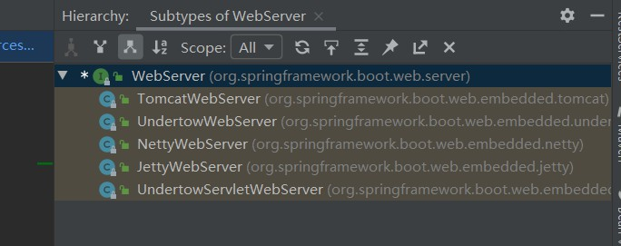

# 一、什么是SprintBoot

> Spring Boot 是 Spring 开源组织下的子项目，是 Spring 组件一站式解决方案，主要是简化了使用 Spring 的难度，简省了繁重的配置，提供了各种启动器，开发者能快速上手。


# 二、SpringBoot的优点与缺点

## 1、优点

1）：快速创建独立运行的Spring项目以及与主流框架集成

2）：使用嵌入式的Servlet容器，应用无需打成war包

3）：starters自动依赖与版本控制

4）：大量的自动配置，简化开发，也可修改默认值

5）：无需配置XML，无代码生成，开箱即用

6）：准生产环境的运行时应用监控

7）：与云计算天然集成

## 2、缺点

1）：入门比较容易，精通难


# 三、微服务简介

## 1、单体应用（ALL IN ONE）

> 所有的页面以及代码都部署在一起


### 1）优点

便于共享：单个归档文件包含所有功能，便于在团队之间以及不同的部署阶段之间共享。
易于测试：单体应用一旦部署，所有的服务或特性就都可以使用了，这简化了测试过程，因为没有额外的依赖，每项测试都可以在部署完成后立刻开始。
易于部署：只需将单个归档文件复制到单个目录下。

### 2）缺点

复杂性高：由于是单个归档文件，所以整个项目文件包含的模块非常多，导致模块的边界模糊、依赖关系不清晰、代码的质量参差不齐，混乱的堆在一起，使得整个项目非常复杂。以致每次修改代码，都非常小心，可能添加一个简单的功能，或者修改一个Bug都会带来隐藏的缺陷。
技术债务：随着时间的推移、需求的变更和技术人员的更替，会逐渐形成应用程序的技术债务，并且越积越多。
扩展能力受限：单体应用只能作为一个整体进行扩展，无法根据业务模块的需要进行伸缩。
阻碍技术创新：对于单体应用来说，技术是在开发之前经过慎重评估后选定的，每个团队成员都必须使用相同的开发语言、持久化存储及消息系统


## 2、微服务

> 微服务，又叫微服务架构，是一种软件架构方式。它将应用构建成一系列按业务领域划分模块的、小的自治服务。每一个功能元素最终都是一个可独立替换和独立升级的软件单元。

​	


### 1）优点

易于开发和维护：一个微服务只会关注一个特定的业务功能，所以业务清晰、代码量较少。开发和维护单个微服务相对简单。
单个微服务启动较快
局部修改容易部署：单体应用只要有修改，就得重新部署整个应用。微服务解决了这样的问题。一般来说，对某个微服务进行修改，只需要重新部署这个服务即可。
技术栈不受限制：在微服务架构中，可以结合项目业务及团队的特点，合理的选择技术栈。
按需伸缩：可根据需求，实现细粒度的扩展。

### 2）缺点

运维要求高：更多的服务意味着要投入更多的运维。
分布式固有的复杂性：使用微服务构建的是分布式系统。对于一个分布式系统，系统容错、网络延迟、分布式事务等都会带来巨大的问题。
接口调整成本高：微服务之间通过接口进行通信。如果修改某一个微服务的API，可能所有用到这个接口的微服务都需要进行调整。

# 四、SpringBoot项目创建流程

第一步：


第二步：


第三步：选择版本和需要的依赖


第四步：


第七步：删除多余文件


# 五、HelloWorld实例

**代码：springboot_example项目**

第一步：创建一个Springboot项目

第二步：创建一个HelloWorld的Controller

第三步：编写代码

```java
package com.rock.controller.hello_word;


import org.springframework.web.bind.annotation.RequestMapping;
import org.springframework.web.bind.annotation.RestController;

@RestController
public class HelloWorldController {

    @RequestMapping("/")
    public String helloWorld(){
        return "Hello World";
    }
}

```


第四步：运行main方法，访问路径：http://127.0.0.1:8080/

```java
/**
 *  @SpringBootApplication  用来标注一个主程序类，说明这是一个Springboot应用
 */
@SpringBootApplication
public class SpringbootExampleApplication {

    public static void main(String[] args) {
        //SpringBoot启动
        SpringApplication.run(SpringbootExampleApplication.class, args);
    }

}
```


# 六、HelloWord探究

## 1、POM文件

父项目

```xml
<parent>
    <groupId>org.springframework.boot</groupId>
    <artifactId>spring-boot-starter-parent</artifactId>
    <version>2.1.5.RELEASE</version>
    <relativePath/>
</parent>
以上项目的父项目
<parent>
    <groupId>org.springframework.boot</groupId>
    <artifactId>spring-boot-dependencies</artifactId>
    <version>2.1.5.RELEASE</version>
    <relativePath>../../spring-boot-dependencies</relativePath>
</parent>

该项目定义了SpringBoot使用其他组件的版本号，如果dependencies没有定义的依赖就需要声明版本号

```

## 2、场景启动器

```xml
<dependency>
    <groupId>org.springframework.boot</groupId>
    <artifactId>spring-boot-starter-web</artifactId>
</dependency>
```

spring-boot-starter：SpringBoot场景启动器

spring-boot-starter-web：web场景的启动器，包含web项目所用的基础依赖

## 3、主程序类，主入口类

```java
/**
 *  @SpringBootApplication  用来标注一个主程序类，说明这是一个Springboot应用
 */
@SpringBootApplication
public class SpringbootExampleApplication {

    public static void main(String[] args) {
        //SpringBoot启动
        SpringApplication.run(SpringbootExampleApplication.class, args);
    }

}
```

### **@SpringBootApplication**

> SpringBoot应用标注在某个类上说明这个类是SpringBoot的主配置类，SpringBoot就应该运行这个类的main方法来启动SpringBoot应用

```java
@Target({ElementType.TYPE})
@Retention(RetentionPolicy.RUNTIME)
@Documented
@Inherited
@SpringBootConfiguration
@EnableAutoConfiguration
@ComponentScan(
    excludeFilters = {@Filter(
    type = FilterType.CUSTOM,
    classes = {TypeExcludeFilter.class}
), @Filter(
    type = FilterType.CUSTOM,
    classes = {AutoConfigurationExcludeFilter.class}
)}
)
public @interface SpringBootApplication {
```

#### **@SpringBootConfiguration**

> Spring Boot的配置类，标注在某个类上表示这个类是一个SpringBoot配置类

```java
@Target({ElementType.TYPE})
@Retention(RetentionPolicy.RUNTIME)
@Documented
@Configuration
public @interface SpringBootConfiguration {
}
```

##### **@Configuration**

> 容器中的一个组件，用于定义配置类，可替换xml配置文件，被注解的类内部包含有一个或多个被@Bean注解的方法，这些方法将会被AnnotationConfigApplicationContext或AnnotationConfigWebApplicationContext类进行扫描，，并用于构建bean定义，初始化Spring容器。SpringBootConfiguration注解继承了该注解

### **@EnableAutoConfiguration**

> 开启自动配置功能

```java
@Target({ElementType.TYPE})
@Retention(RetentionPolicy.RUNTIME)
@Documented
@Inherited
@AutoConfigurationPackage
@Import({AutoConfigurationImportSelector.class})
public @interface EnableAutoConfiguration {
```

#### **@AutoConfigurationPackage**

> 自动配置包

```java
@Target({ElementType.TYPE})
@Retention(RetentionPolicy.RUNTIME)
@Documented
@Inherited
@Import({Registrar.class})
public @interface AutoConfigurationPackage {
}
```

##### **@Import({Registrar.class})**

> Spring的底层注解@Import，给容器中导入一个组件，导入的组件由Registrar.class来指定

```java
//metadata：@SpringBootApplication标注类的基本信息
public void registerBeanDefinitions(AnnotationMetadata metadata, BeanDefinitionRegistry registry) {
            AutoConfigurationPackages.register(registry, (new AutoConfigurationPackages.PackageImport(metadata)).getPackageName());
        }
//new AutoConfigurationPackages.PackageImport(metadata)).getPackageName() 会获取到标注了@SpringBootApplication注解的类所在的包以及下面所有子包里面的所有组件扫描到Spring容器
```


#### @Import({AutoConfigurationImportSelector.class})

AutoConfigurationImportSelector类

> 将所有需要导入的组件以全类名的方式返回；这些组件就会被添加到容器中

```java
/**
*	会给容器中导入非常多的自动配置类（xxxAutoConfiguration）；就是给容器中导入这个场景需要的所有组件，*   并配置好这些组件；
*/
protected AutoConfigurationImportSelector.AutoConfigurationEntry getAutoConfigurationEntry(AutoConfigurationMetadata autoConfigurationMetadata, AnnotationMetadata annotationMetadata) {
        if (!this.isEnabled(annotationMetadata)) {
            return EMPTY_ENTRY;
        } else {
            AnnotationAttributes attributes = this.getAttributes(annotationMetadata);
            List<String> configurations = this.getCandidateConfigurations(annotationMetadata, attributes);
            configurations = this.removeDuplicates(configurations);
            Set<String> exclusions = this.getExclusions(annotationMetadata, attributes);
            this.checkExcludedClasses(configurations, exclusions);
            configurations.removeAll(exclusions);
            configurations = this.filter(configurations, autoConfigurationMetadata);
            this.fireAutoConfigurationImportEvents(configurations, exclusions);
            return new AutoConfigurationImportSelector.AutoConfigurationEntry(configurations, exclusions);
        }
    }
```

会给容器中导入非常多的自动配置类（xxxAutoConfiguration）；就是给容器中导入这个场景需要的所有组件，并配置好这些组件；		


# 七、SpringBoot的配置文件

**代码：springboot_config 项目中**

SpringBoot使用一个全局的配置文件，配置文件名是固定的；

•application.properties

•application.yml

配置文件的作用：修改SpringBoot自动配置的默认值；SpringBoot在底层都给我们自动配置好；

标记语言：

​	以前的配置文件；大多都使用的是  **xxxx.xml**文件；

​	YAML：**以数据为中心**，比json、xml等更适合做配置文件；

​	YAML：配置例子

```yaml
server:
  port: 8081
```

​	XML：

```xml
<server>
	<port>8081</port>
</server>
```

## 1、YAML语法

### 1）基本语法

K:(空格)V：表示一对键值对（空格必须有）

以空格的缩进来控制层级关系，只要左对齐的一列数据，都是同一个层级的

```yaml
server:
	port: 8081
	path: /test
```

属性和值的大小写敏感


## 2、值的写法

### 1）字面量：普通的值（数字、字符串、布尔）

k: v ：字面直接写

​		字符串默认不用加上单引号或者双引号

​		**双引号：**不会转义字符串里面的特殊字符，特殊字符会作为本身想表示的意思

​		例如： “test \n aa”

​		输出：test 换行 aa

​		**单引号：**会转义特殊字符，特殊字符最终只是一个普通的字符串数据

​		例如：‘test \n aa’

​		输出：test \n aa

### 2）对象、Map（属性和值）（键值对）

k: v：在下一行来写对象的属性和值的关系；注意缩进

​		对象还是k: v的方式

```yaml
friends:
		lastName: zhangsan
		age: 20
```

行内写法：

```yaml
friends: {lastName: zhangsan,age: 18}
```


#### 数组（List、Set）：

用- 值表示数组中的一个元素

```yaml
pets:
 - cat
 - dog
 - pig
```

行内写法

```yaml
pets: [cat,dog,pig]
```

### 3）配置文件值的注入

###### **使用@ConfigurationProperties**注入

**①：导入配置处理器**

```xml
<dependency>
    <groupId>org.springframework.boot</groupId>
    <artifactId>spring-boot-configuration-processor</artifactId>
    <optional>true</optional>
</dependency>
```

如果不导入文件处理器，编写YMAL的时候没有提示，并且会提示你添加


**②：Bean对象**

```java
/**
 * @ConfigurationProperties：告诉SpringBoot将本类中的所有属性和配置文件中相关的配置进行绑定
 * prefix = "friend" ：配置文件中哪个属性下面的属性进行一一映射
 *
 * 这个组件必须是容器中的组件，才能使用容器提供的@ConfigurationProperties 功能
 */
@Component
@ConfigurationProperties(prefix = "person")
public class Person {

    private String name;

    private int age;

    private Date birthday;

    private List<String> list;

    private Map<String, String> maps;

    private Dog dog;

    public String getName() {
        return name;
    }

    public void setName(String name) {
        this.name = name;
    }

    public int getAge() {
        return age;
    }

    public void setAge(int age) {
        this.age = age;
    }

    public List<String> getList() {
        return list;
    }

    public void setList(List<String> list) {
        this.list = list;
    }

    public Map<String, String> getMaps() {
        return maps;
    }

    public void setMaps(Map<String, String> maps) {
        this.maps = maps;
    }

    public Dog getDog() {
        return dog;
    }

    public void setDog(Dog dog) {
        this.dog = dog;
    }

    public Date getBirthday() {
        return birthday;
    }

    public void setBirthday(Date birthday) {
        this.birthday = birthday;
    }

    @Override
    public String toString() {
        return "Person{" +
                "name='" + name + '\'' +
                ", age=" + age +
                ", birthday=" + birthday +
                ", list=" + list +
                ", maps=" + maps +
                ", dog=" + dog +
                '}';
    }
}
```

```java
public class Dog {

    private String name;

    private int age;

    public String getName() {
        return name;
    }

    public void setName(String name) {
        this.name = name;
    }

    public int getAge() {
        return age;
    }

    public void setAge(int age) {
        this.age = age;
    }

    @Override
    public String toString() {
        return "Dog{" +
                "name='" + name + '\'' +
                ", age=" + age +
                '}';
    }
}
```

**③：YMAL编写**

```yam
person:
  name: 张三
  age: 18
  list:
    - list1
    - list2
    - list3
  maps:
    key1: value1
    key2:  value2
  dog:
    name: 旺财
    age: 2
  birthday: 1997/10/28 10:59:59

```

④：使用SpringBoot提供的测试类测试


**properties格式文件注入**

将application.yml 中的配置注释，在application.properties 配置文件中编写

```properties
person.name=张三
person.age=15
person.list=1,2,3
person.maps.key1=value1
person.maps.key2=value2
person.birthday=1999/12/10 10:30:44
person.dog.name=旺财
person.dog.age=3
```

其他不变，运行测试类

这时候会发现中文是乱码的


找到File Encodings  ，勾选运行时转换成ASCII码，就不会乱码了


###### 使用@Value注入

```java
@Component
public class PersonValue {

    @Value("${person.name}")
    private String name;

    @Value("#{11*2}")
    private int age;

    private Date birthday;

    private List<String> list;

    private Map<String, String> maps;

    private Dog dog;

    public String getName() {
        return name;
    }

    public void setName(String name) {
        this.name = name;
    }

    public int getAge() {
        return age;
    }

    public void setAge(int age) {
        this.age = age;
    }

    public List<String> getList() {
        return list;
    }

    public void setList(List<String> list) {
        this.list = list;
    }

    public Map<String, String> getMaps() {
        return maps;
    }

    public void setMaps(Map<String, String> maps) {
        this.maps = maps;
    }

    public Dog getDog() {
        return dog;
    }

    public void setDog(Dog dog) {
        this.dog = dog;
    }

    public Date getBirthday() {
        return birthday;
    }

    public void setBirthday(Date birthday) {
        this.birthday = birthday;
    }

    @Override
    public String toString() {
        return "Person{" +
                "name='" + name + '\'' +
                ", age=" + age +
                ", birthday=" + birthday +
                ", list=" + list +
                ", maps=" + maps +
                ", dog=" + dog +
                '}';
    }
}
```


###### @ConfigurationProperties与@Value注入的区别

|                      | @ConfigurationProperties | @Value     |
| -------------------- | :----------------------- | ---------- |
| 功能                 | 批量注入配置文件中的属性 | 一个个指定 |
| 松散绑定（松散语法） | 支持                     | 不支持     |
| SpEL                 | 不支持                   | 支持       |
| JSR303数据校验       | 支持                     | 不支持     |
| 复杂类型封装         | 支持                     | 不支持     |
|                      |                          |            |


###### @PropertySource，指定读取的配置文件

```java
/**
 * @PropertySource：指定加载某个配置文件中配置
 * value：配置文件路径
 */
@Component
@PropertySource(value = {"classpath:personSource.properties"})
@ConfigurationProperties(prefix = "personsourcebean")
public class PersonSourceBean {
    private String name;

    private int age;

    private Date birthday;

    private List<String> list;

    private Map<String, String> maps;

    private Dog dog;

    public String getName() {
        return name;
    }

    public void setName(String name) {
        this.name = name;
    }

    public int getAge() {
        return age;
    }

    public void setAge(int age) {
        this.age = age;
    }

    public List<String> getList() {
        return list;
    }

    public void setList(List<String> list) {
        this.list = list;
    }

    public Map<String, String> getMaps() {
        return maps;
    }

    public void setMaps(Map<String, String> maps) {
        this.maps = maps;
    }

    public Dog getDog() {
        return dog;
    }

    public void setDog(Dog dog) {
        this.dog = dog;
    }

    public Date getBirthday() {
        return birthday;
    }

    public void setBirthday(Date birthday) {
        this.birthday = birthday;
    }

    @Override
    public String toString() {
        return "PersonSourceBean{" +
                "name='" + name + '\'' +
                ", age=" + age +
                ", birthday=" + birthday +
                ", list=" + list +
                ", maps=" + maps +
                ", dog=" + dog +
                '}';
    }
}
```

@ImportResource

> 导入Spring的配置文件，让配置文件里面的内容生效；

Spring Boot里面没有Spring的配置文件，我们自己编写的配置文件，也不能自动识别；

想让Spring的配置文件生效，加载进来；@**ImportResource**标注在启动类上

```java
@ImportResource(locations = {"classpath:beans.xml"})
@SpringBootApplication
public class SpringbootConfigApplication {

    public static void main(String[] args) {
        SpringApplication.run(SpringbootConfigApplication.class, args);
    }

}
```

配置文件

```xml
<?xml version="1.0" encoding="UTF-8"?>
<beans xmlns="http://www.springframework.org/schema/beans"
       xmlns:xsi="http://www.w3.org/2001/XMLSchema-instance"
       xsi:schemaLocation="http://www.springframework.org/schema/beans http://www.springframework.org/schema/beans/spring-beans.xsd">
    <bean id="importResourceService" class="com.rock.service.ImportResourceService"></bean>
</beans>
```

###### @Bean注入

```java
/**
 * @Configuration:表示该类为一个配置类
 */
@Configuration
public class ImportResourceConfig {

    /**
     * 将方法的返回值添加到容器中
     * 容器中组件的ID就是方法的名称
     * @return 需要注入的对象
     */
    @Bean
    public ImportResourceService importResourceService() {
        System.out.println("进入配置配置类方法");
        return new ImportResourceService();
    }
}
```

两者选其一，SpringBoot推荐使用@Bean注入

## 4）配置文件占位符

### ①、随机数

```java
${random.value}：产生一个随机字符串
${random.int}：产生一个随机整数
${random.long}：产生一个随机long类型数字
${random.int(10)}：产生一个小于10的整数
${random.int[1,4]}：产生一个大于等于1小于4的整数

```

### ②、获取之前配置的值

```java
${字段名}
```

实例：

```properties
person.name=张三${random.value}
person.age=${random.int[1,2]}
person.list=1,2,3
person.maps.key1=value1
person.maps.key2=value2
person.birthday=1999/12/10 10:30:44
person.dog.name=${person.name}旺财
person.dog.age=${random.int(1,4)}
```

# 八、Profile多环境配置

**代码：springboot_profile项目**

注意：如果application.properties与application.yml 同时存在时，application.properties生效

## 1、多Profile文件

> 将properties或者yml文件按：application-{profile}.properties，application-{profile}.yml

例如：application-dev.properties

## 2、yml支持多文档块方式

```yml
spring:
  profiles:
    active: dev
---
spring:
  profiles: prod
server:
  port: 8082

---
spring:
  profiles: dev
server:
  port: 8083

```

> 使用  ---  在yml文件中隔开多个document，可以用：spring:profiles:  给每个document取名，再使用active激活不同的document

## 3、激活指定profile

①：springboot默认使用：application.properties，可以再默认使用的配置文件中激活profile文件

spring.profiles.active=profile名称

例：

```properties
spring.profiles.active=dev
```

②：命令行激活

--spring.profiles.active=dev


> 如果使用命令行激活，会以命令行激活的为准

使用启动命令激活

java -jar （jar包名称） --spring.profiles.active=dev


③：虚拟机参数

-Dspring.profiles.active=dev


## 4、配置文件的加载位置

springboot 启动会扫描以下位置的application.properties或者application.yml文件作为Spring boot的默认配置文 件
–file:./config/

–file:./ 

–classpath:/config/ 

–classpath:/

**优先级由高到低，高优先级的配置会覆盖低优先级的配置；**

SpringBoot会从这四个位置全部加载主配置文件；互补配置；

我们还可以通过spring.config.location来改变默认的配置文件位置

项目打包好以后，我们可以使用命令行参数的形式，启动项目的时候来指定配置文件的新位置；指定配置文件和默 

认加载的这些配置文件共同起作用形成互补配置；

java -jar spring-boot-02-config-02-0.0.1-SNAPSHOT.jar --spring.config.location=G:/application.properties


## 5、外部配置加载顺序

**SpringBoot也可以从以下位置加载配置； 优先级从高到低；高优先级的配置覆盖低优先级的配置，所有的配置会 形成互补配置**

**由jar包外向jar包内进行寻找； 优先加载带profile    再来加载不带profile **

1.命令行参数

所有的配置都可以在命令行上进行指定

java -jar spring-boot-02-config-02-0.0.1-SNAPSHOT.jar --server.port=8087 --server.context-path=/abc 

多个配置用空格分开； --配置项=值  

2.来自java:comp/env的JNDI属性 

3.Java系统属性（System.getProperties()）

4.操作系统环境变量 

5.RandomValuePropertySource配置的random.* 属性值  

6.jar包外部的application-{profile}.properties或application.yml(带spring.profile)配置文件

7.jar包内部的application-{profile}.properties或application.yml(带spring.profile)配置文件  

8.jar包外部的application.properties或application.yml(不带spring.profile)配置文件 

9.jar包内部的application.properties或application.yml(不带spring.profile)配置文件

10.@Configuration注解类上的@PropertySource

11.通过SpringApplication.setDefaultProperties指定的默认属性


# 九、自动配置原理

## 1、自动配置介绍

官方配置参考地址：

目录找：Common application properties

https://docs.spring.io/spring-boot/docs/1.5.9.RELEASE/reference/htmlsingle/#common-application-properties

**@SpringBootApplication注解：**

```java
@Target(ElementType.TYPE)
@Retention(RetentionPolicy.RUNTIME)
@Documented
@Inherited
@SpringBootConfiguration
@EnableAutoConfiguration
@ComponentScan(excludeFilters = { @Filter(type = FilterType.CUSTOM, classes = TypeExcludeFilter.class),
@Filter(type = FilterType.CUSTOM, classes = AutoConfigurationExcludeFilter.class) })
@ConfigurationPropertiesScan
```

**@EnableAutoConfiguration注解：利用AutoConfigurationImportSelector给容器中导入组件**

```java
@Target(ElementType.TYPE)
@Retention(RetentionPolicy.RUNTIME)
@Documented
@Inherited
@AutoConfigurationPackage
@Import(AutoConfigurationImportSelector.class)
```

**AutoConfigurationImportSelector类**

**selectImports()方法**

```java
public String[] selectImports(AnnotationMetadata annotationMetadata) {
		if (!isEnabled(annotationMetadata)) {
			return NO_IMPORTS;
		}
		AutoConfigurationMetadata autoConfigurationMetadata = AutoConfigurationMetadataLoader
				.loadMetadata(this.beanClassLoader);
		AutoConfigurationEntry autoConfigurationEntry = getAutoConfigurationEntry(autoConfigurationMetadata,
				annotationMetadata);//注意该行代码
		return StringUtils.toStringArray(autoConfigurationEntry.getConfigurations());
	}
```

**getAutoConfigurationEntry()**

```java
protected AutoConfigurationEntry getAutoConfigurationEntry(AutoConfigurationMetadata autoConfigurationMetadata,
			AnnotationMetadata annotationMetadata) {
		if (!isEnabled(annotationMetadata)) {
			return EMPTY_ENTRY;
		}
		AnnotationAttributes attributes = getAttributes(annotationMetadata);
		List<String> configurations = getCandidateConfigurations(annotationMetadata, attributes);//注意这行代码
		configurations = removeDuplicates(configurations);
		Set<String> exclusions = getExclusions(annotationMetadata, attributes);
		checkExcludedClasses(configurations, exclusions);
		configurations.removeAll(exclusions);
		configurations = filter(configurations, autoConfigurationMetadata);
		fireAutoConfigurationImportEvents(configurations, exclusions);
		return new AutoConfigurationEntry(configurations, exclusions);
	}
```

**getCandidateConfigurations()**

```java
protected List<String> getCandidateConfigurations(AnnotationMetadata metadata, AnnotationAttributes attributes) {
		List<String> configurations = SpringFactoriesLoader.loadFactoryNames(getSpringFactoriesLoaderFactoryClass(),
				getBeanClassLoader());//注意这行代码
		Assert.notEmpty(configurations, "No auto configuration classes found in META-INF/spring.factories. If you "
				+ "are using a custom packaging, make sure that file is correct.");
		return configurations;
	}
```

**loadFactoryNames()**

```java
public static List<String> loadFactoryNames(Class<?> factoryType, @Nullable ClassLoader classLoader) {
    	//获取类的全路径
        String factoryTypeName = factoryType.getName();
        return (List)loadSpringFactories(classLoader).getOrDefault(factoryTypeName, Collections.emptyList());//注意这行代码
    }
```

**loadSpringFactories()**

```java
    private static Map<String, List<String>> loadSpringFactories(@Nullable ClassLoader classLoader) {
        MultiValueMap<String, String> result = (MultiValueMap)cache.get(classLoader);
        if (result != null) {
            return result;
        } else {
            try {
                //获取类路径下的资源"META-INF/spring.factories
                Enumeration<URL> urls = classLoader != null ? classLoader.getResources("META-INF/spring.factories") : ClassLoader.getSystemResources("META-INF/spring.factories");
                LinkedMultiValueMap result = new LinkedMultiValueMap();

                while(urls.hasMoreElements()) {
                    URL url = (URL)urls.nextElement();
                    UrlResource resource = new UrlResource(url);
                    //将URL转换成Properties
                    Properties properties = PropertiesLoaderUtils.loadProperties(resource);
                    Iterator var6 = properties.entrySet().iterator();

                    while(var6.hasNext()) {
                        Entry<?, ?> entry = (Entry)var6.next();
                        String factoryTypeName = ((String)entry.getKey()).trim();
                        String[] var9 = StringUtils.commaDelimitedListToStringArray((String)entry.getValue());
                        int var10 = var9.length;

                        for(int var11 = 0; var11 < var10; ++var11) {
                            String factoryImplementationName = var9[var11];
                            result.add(factoryTypeName, factoryImplementationName.trim());
                        }
                    }
                }

                cache.put(classLoader, result);
                return result;
            } catch (IOException var13) {
                throw new IllegalArgumentException("Unable to load factories from location [META-INF/spring.factories]", var13);
            }
        }
    }
```


**以HttpEncodingAutoConfiguration类为例：**

```java
@Configuration(proxyBeanMethods = false)//表示这是一个配置类
@EnableConfigurationProperties(HttpProperties.class)//启动指定类的 ConfigurationProperties功能；将配置文件中对应的值和HttpEncodingProperties绑定起来；并把 HttpEncodingProperties加入到ioc容器中 
@ConditionalOnWebApplication(type = ConditionalOnWebApplication.Type.SERVLET)///判断当前应用是否为一个web应用，是则改配置类生效；@Conditional是Spring顶层注解，用来根据条件决定配置是否生效
@ConditionalOnClass(CharacterEncodingFilter.class)//判断当前项目有没有这个类 CharacterEncodingFilter；SpringMVC中进行乱码解决的过滤器； 
@ConditionalOnProperty(prefix = "spring.http.encoding", value = "enabled", matchIfMissing = true) //判断配置文件中是否存在某个配置  spring.http.encoding.enabled；如果不存在，判断也是成立的 //即使我们配置文件中不配置pring.http.encoding.enabled=true，也是默认生效的； 
public class HttpEncodingAutoConfiguration {

    //SpringBoot的配置文件映射了 
	private final HttpProperties.Encoding properties;

    //只有一个有参构造器的情况下，参数的值就会从容器中拿 
	public HttpEncodingAutoConfiguration(HttpProperties properties) {
		this.properties = properties.getEncoding();
	}

    ///给容器中添加一个组件，这个组件的某些值需要从properties中获取 
	@Bean
	@ConditionalOnMissingBean //判断容器没有这个组件
	public CharacterEncodingFilter characterEncodingFilter() {
		CharacterEncodingFilter filter = new OrderedCharacterEncodingFilter();
		filter.setEncoding(this.properties.getCharset().name());
		filter.setForceRequestEncoding(this.properties.shouldForce(Type.REQUEST));
		filter.setForceResponseEncoding(this.properties.shouldForce(Type.RESPONSE));
		return filter;
	}

	@Bean
	public LocaleCharsetMappingsCustomizer localeCharsetMappingsCustomizer() {
		return new LocaleCharsetMappingsCustomizer(this.properties);
	}

	private static class LocaleCharsetMappingsCustomizer
			implements WebServerFactoryCustomizer<ConfigurableServletWebServerFactory>, Ordered {

		private final HttpProperties.Encoding properties;

		LocaleCharsetMappingsCustomizer(HttpProperties.Encoding properties) {
			this.properties = properties;
		}

		@Override
		public void customize(ConfigurableServletWebServerFactory factory) {
			if (this.properties.getMapping() != null) {
				factory.setLocaleCharsetMappings(this.properties.getMapping());
			}
		}

		@Override
		public int getOrder() {
			return 0;
		}

	}

}
```

所有在配置文件中能配置的属性都是在xxxxProperties类中封装者；配置文件能配置什么就可以参照某个功 能对应的这个属性类

```java
@ConfigurationProperties(prefix = "spring.http")
public class HttpProperties {

	/**
	 * Whether logging of (potentially sensitive) request details at DEBUG and TRACE level
	 * is allowed.
	 */
	private boolean logRequestDetails;

	/**
	 * HTTP encoding properties.
	 */
	private final Encoding encoding = new Encoding();

	public boolean isLogRequestDetails() {
		return this.logRequestDetails;
	}

	public void setLogRequestDetails(boolean logRequestDetails) {
		this.logRequestDetails = logRequestDetails;
	}

	public Encoding getEncoding() {
		return this.encoding;
	}

	/**
	 * Configuration properties for http encoding.
	 在properties中可以配置的属性
	 */
	public static class Encoding {

		public static final Charset DEFAULT_CHARSET = StandardCharsets.UTF_8;

		/**
		 * Charset of HTTP requests and responses. Added to the "Content-Type" header if
		 * not set explicitly.
		 */
		private Charset charset = DEFAULT_CHARSET;

		/**
		 * Whether to force the encoding to the configured charset on HTTP requests and
		 * responses.
		 */
		private Boolean force;

		/**
		 * Whether to force the encoding to the configured charset on HTTP requests.
		 * Defaults to true when "force" has not been specified.
		 */
		private Boolean forceRequest;

		/**
		 * Whether to force the encoding to the configured charset on HTTP responses.
		 */
		private Boolean forceResponse;

		/**
		 * Locale in which to encode mapping.
		 */
		private Map<Locale, Charset> mapping;

		public Charset getCharset() {
			return this.charset;
		}

		public void setCharset(Charset charset) {
			this.charset = charset;
		}

		public boolean isForce() {
			return Boolean.TRUE.equals(this.force);
		}

		public void setForce(boolean force) {
			this.force = force;
		}

		public boolean isForceRequest() {
			return Boolean.TRUE.equals(this.forceRequest);
		}

		public void setForceRequest(boolean forceRequest) {
			this.forceRequest = forceRequest;
		}

		public boolean isForceResponse() {
			return Boolean.TRUE.equals(this.forceResponse);
		}

		public void setForceResponse(boolean forceResponse) {
			this.forceResponse = forceResponse;
		}

		public Map<Locale, Charset> getMapping() {
			return this.mapping;
		}

		public void setMapping(Map<Locale, Charset> mapping) {
			this.mapping = mapping;
		}

		public boolean shouldForce(Type type) {
			Boolean force = (type != Type.REQUEST) ? this.forceResponse : this.forceRequest;
			if (force == null) {
				force = this.force;
			}
			if (force == null) {
				force = (type == Type.REQUEST);
			}
			return force;
		}

		public enum Type {

			REQUEST, RESPONSE

		}

	}

}
```

根据当前不同的条件判断，决定这个配置类是否生效

一但这个配置类生效，这个配置类就会给容器中添加各种组件，这些组件的属性是从对应的properties类中获取 的，这些类里面的每一个属性又是和配置文件绑定的


**精髓：**

 **1）、SpringBoot启动会加载大量的自动配置类**
  **2）、我们看我们需要的功能有没有SpringBoot默认写好的自动配置类；**
  **3）、我们再来看这个自动配置类中到底配置了哪些组件；（只要我们要用的组件有，我们就不需要再来配置了）**

 **4）、给容器中自动配置类添加组件的时候，会从properties类中获取某些属性。我们就可以在配置文件中指定这 些属性的值；**

xxxxAutoConfigurartion：自动配置类；
给容器中添加组件

xxxxProperties:封装配置文件中相关属性；


## 2、@Conditional

@Conditional派生注解（Spring注解版原生的@Conditional作用） 
作用：必须是@Conditional指定的条件成立，才给容器中添加组件，配置配里面的所有内容才生效；

| @Conditional扩展注解            | 作用（判断是否满足当前指定条件）                 |
| :------------------------------ | :----------------------------------------------- |
| @ConditionalOnJava              | 系统的java版本是否符合要求                       |
| @ConditionalOnBean              | 容器中存在指定Bean                               |
| @ConditionalOnMissingBean       | 容器中不存在指定Bean                             |
| @ConditionalOnExpression        | 满足SpEL表达式指定                               |
| @ConditionalOnClass             | 系统中有指定的类                                 |
| @ConditionalOnMissingClass      | 系统中没有指定的类                               |
| @ConditionalOnSingleCandidate   | 容器中只有一个指定的Bean，或者这个Bean是首选Bean |
| @ConditionalOnProperty          | 系统中指定的属性是否有指定的值                   |
| @ConditionalOnResource          | 类路径下是否存在指定资源文件                     |
| @ConditionalOnWebApplication    | 当前是web环境                                    |
| @ConditionalOnNotWebApplication | 当前不是web环境                                  |
| @ConditionalOnJndi              | JNDI存在指定项                                   |

## 3、如何知道哪些自动配置类生效

在配置文件中添加：debug=true  来让控制台打印自动配置报告

```java
============================
CONDITIONS EVALUATION REPORT
============================


Positive matches:(启用的自动配置)
-----------------

   DispatcherServletAutoConfiguration matched:
      - @ConditionalOnClass found required class 'org.springframework.web.servlet.DispatcherServlet' (OnClassCondition)
      - found 'session' scope (OnWebApplicationCondition)

   DispatcherServletAutoConfiguration.DispatcherServletConfiguration matched:
      - @ConditionalOnClass found required class 'javax.servlet.ServletRegistration' (OnClassCondition)
      - Default DispatcherServlet did not find dispatcher servlet beans (DispatcherServletAutoConfiguration.DefaultDispatcherServletCondition)
          
          
          
          
Negative matches:(没用配置成功的自动配置类)
-----------------

   ActiveMQAutoConfiguration:
      Did not match:
         - @ConditionalOnClass did not find required class 'javax.jms.ConnectionFactory' (OnClassCondition)

   AopAutoConfiguration:
      Did not match:
         - @ConditionalOnClass did not find required class 'org.aspectj.lang.annotation.Aspect' (OnClassCondition)

```

# 十：日志框架分类和选择

## 1、日志框架的选择

| 日志门面  （日志的抽象层）                                   | 日志实现                                       |
| ------------------------------------------------------------ | ---------------------------------------------- |
| ~~JCL（Jakarta  Commons Logging）~~  ~~jboss-logging~~  SLF4j（Simple  Logging Facade for Java） | Log4j  JUL（java.util.logging）Log4j2  Logback |

JCL：上一次更新在2014年。

jboss-logging：不是为普通程序员用


Log4j：与LogBack，SLF4j是同一个人编写，有性能问题

Log4j2：没有和大多数框架适配

Logback：与SLF4j适配性更好

SpringBoot选用SLF4j与Logback做为日志框架


## 2、SLF4j的使用

1）如何在系统中使用SLF4j

以后开发的时候，日志记录方法的调用，不应该来直接调用日志的实现类，而是调用日志抽象层里面的方法；

导入slf4j以及Logback的实现jar（也可以使用其他的实现）

```java
import org.slf4j.Logger;
import org.slf4j.LoggerFactory;

public class HelloWorld {
  public static void main(String[] args) {
    Logger logger = LoggerFactory.getLogger(HelloWorld.class);
    logger.info("Hello World");
  }
}
```

图示：


每一个日志的实现框架都有自己的配置文件，使用slf4j以后，**配置文件还是做成日志实现框架自己本身的配置文件**


## 3、遗留问题

各个框架，日志实现框架不一致问题

统一日志记录，所有的框架都使用slf4j


**如何让系统中所有的日志都统一到slf4j**

①、将系统中其他日志框架先排除出去

②、用中间包来替换原有的日志框架

③、导入slf4j其他的实现

## 4、SpringBoot与日志的关系

①：SpringBoot底层也是使用slf4j+logback的方式进行日志记录

②：SpringBoot也把其他的日志都替换成了slf4j

③：引用中间包

## 5、如果引入其他框架，一定要把这个框架的默认日志移除掉么？

SpringBoot能自动适配所有的日志，而且底层使用slf4j+Logback的方式记录日志，引入其他框架的时候，只需要把这个框架依赖的日志框架排除掉。


## 6、日志的使用

代码：唯一测试类中

### ①：默认配置

```java
@SpringBootTest
class SpringbootLoggingApplicationTests {

    //记录器
    Logger logger=LoggerFactory.getLogger(getClass());

    @Test
    void contextLoads() {
        //日志级别
        //由低到高
        //可以调整输出的日志级别
        logger.trace("这是trace日志。");
        logger.debug("这是debug日志。");
        logger.info("这是info日志。");
        logger.warn("这是warn日志。");
        logger.error("这是error日志。");
    }

}
```

```txt
日志输出格式： 
	%d表示日期时间，
	%thread表示线程名，
    %‐5level：级别从左显示5个字符宽度 
    %logger{50} 表示logger名字长50个字符，否则按照句点分割。 
    %msg：日志消息， 
    %n是换行符           
    ‐‐>    
    %d{yyyy‐MM‐dd HH:mm:ss.SSS} [%thread] %‐5level %logger{50} ‐ %msg%n

```

### ②：SpringBoot修改默认配置

```properties
# 日志级别
logging.level.com.rock=trace
# 不指定路径，在当前项目下生成springboot.log日志
#logging.file.name=springboot.log
# 可以指定完整路径
#logging.file.name=E:/springboot.log

# 在当前磁盘的根目录下创建springboot文件夹，使用spring.log作为默认文件  一般都配置这个
logging.file.path=/springboot

# 在控制台输出的日志格式
#logging.pattern.console=%d{yyyy‐MM‐dd} [%thread] %‐5level %logger{50} ‐ %msg%n
# 指定文件中日志输出的格式
#logging.pattern.file=%d{yyyy‐MM‐dd} === [%thread] === %‐5level === %logger{50} ==== %msg%n

```


### ③：指定配置

给类路径下放上每个日志框架自己的配置文件即可；SpringBoot就不使用他默认配置的了

| Logging System          | Customization                                                |
| ----------------------- | ------------------------------------------------------------ |
| Logback                 | logback-spring.xml , logback-spring.groovy , logback.xml or logback.groovy |
| Log4j2                  | log4j2-spring.xml or log4j2.xml                              |
| JDK (Java Util Logging) | logging.properties                                           |

logback.xml：直接就被日志框架识别了； 

logback-spring.xml：日志框架就不直接加载日志的配置项，由SpringBoot解析日志配置，可以使用SpringBoot 的高级Profile功能

```xml
<springProfile name="staging">     <!‐‐ configuration to be enabled when the "staging" profile is active ‐‐>    可以指定某段配置只在某个环境下生效    </springProfile> 
```

例如：

```xml
    <appender name="stdout" class="ch.qos.logback.core.ConsoleAppender">
        <!--
        日志输出格式：
			%d表示日期时间，
			%thread表示线程名，
			%-5level：级别从左显示5个字符宽度
			%logger{50} 表示logger名字最长50个字符，否则按照句点分割。
			%msg：日志消息，
			%n是换行符
        -->
        <layout class="ch.qos.logback.classic.PatternLayout">
            <springProfile name="dev">
                <pattern>%d{yyyy-MM-dd HH:mm:ss.SSS}---> [%thread] %level ---> %logger{50} - %msg%n</pattern>
            </springProfile>
            <springProfile name="!dev">
                <pattern>%d{yyyy‐MM‐dd HH:mm:ss.SSS} ==== [%thread] ==== %‐5level  %logger{50} ‐ %msg%n</pattern>
            </springProfile>
        </layout>
    </appender>
```

如果使用logback.xml作为日志配置文件，还要使用profile功能，会有以下错误
**no applicable action for [springProfile]** 


# 十一、SpringBoot与WEB开发

## 1、SpringBoot对静态资源的映射规则

```java
@ConfigurationProperties(prefix = "spring.resources", ignoreUnknownFields = false)
public class ResourceProperties {
//可以设置和静态资源有关的参数，缓存时间等
```

```java
public void addResourceHandlers(ResourceHandlerRegistry registry) {
            if (!this.resourceProperties.isAddMappings()) {
                logger.debug("Default resource handling disabled");
            } else {
                Duration cachePeriod = this.resourceProperties.getCache().getPeriod();
                CacheControl cacheControl = this.resourceProperties.getCache().getCachecontrol().toHttpCacheControl();
                if (!registry.hasMappingForPattern("/webjars/**")) {
                    this.customizeResourceHandlerRegistration(registry.addResourceHandler(new String[]{"/webjars/**"}).addResourceLocations(new String[]{"classpath:/META-INF/resources/webjars/"}).setCachePeriod(this.getSeconds(cachePeriod)).setCacheControl(cacheControl));
                }

                String staticPathPattern = this.mvcProperties.getStaticPathPattern();
                if (!registry.hasMappingForPattern(staticPathPattern)) {
                    this.customizeResourceHandlerRegistration(registry.addResourceHandler(new String[]{staticPathPattern}).addResourceLocations(WebMvcAutoConfiguration.getResourceLocations(this.resourceProperties.getStaticLocations())).setCachePeriod(this.getSeconds(cachePeriod)).setCacheControl(cacheControl));
                }

            }
        }


//配置首页
		@Bean
		public WelcomePageHandlerMapping welcomePageHandlerMapping(ApplicationContext applicationContext,
				FormattingConversionService mvcConversionService, ResourceUrlProvider mvcResourceUrlProvider) {
			WelcomePageHandlerMapping welcomePageHandlerMapping = new WelcomePageHandlerMapping(
					new TemplateAvailabilityProviders(applicationContext), applicationContext, getWelcomePage(),
					this.mvcProperties.getStaticPathPattern());
			welcomePageHandlerMapping.setInterceptors(getInterceptors(mvcConversionService, mvcResourceUrlProvider));
			return welcomePageHandlerMapping;
		}
```

**1)、所有的/webjars/**，都去 classpath:/METAINF/resources/webjars/ 找资源**

​		webjars：以jar包的方式引入   https://www.webjars.org/

```xml
<!--引入jQuery-->
        <dependency>
            <groupId>org.webjars</groupId>
            <artifactId>jquery</artifactId>
            <version>3.3.1</version>
        </dependency>
```

**2）、"/**"：访问当前项目的任何资源（静态资源的文件夹）**

```java
"classpath:/META-INF/resources/"
"classpath:/resources/"
"classpath:/static/"
"classpath:/public/"
"/**":当前项目根路径
```

**3）、欢迎页；静态资源文件夹下所有index.html页面**


## 2、模板引擎

thymeleaf：语法更简单，功能更强大

### 1)、引入thymeleaf

```xml
<dependency>
   <groupId>org.springframework.boot</groupId>
   <artifactId>spring-boot-starter-thymeleaf</artifactId>
</dependency>
```

### 2)、thymeleaf自动配置

```java
@ConfigurationProperties(prefix = "spring.thymeleaf")
public class ThymeleafProperties {

	private static final Charset DEFAULT_ENCODING = StandardCharsets.UTF_8;

	public static final String DEFAULT_PREFIX = "classpath:/templates/";//前缀

	public static final String DEFAULT_SUFFIX = ".html";//后缀
	//只需要吧HTML页面放在classpath:/templates/，templates就会自动渲染
```

### 3）、测试thymeleaf的使用

①：引入thymeleaf

```xml
<dependency>
   <groupId>org.springframework.boot</groupId>
   <artifactId>spring-boot-starter-thymeleaf</artifactId>
</dependency>
```

②：在resources/templates下编写success.html

③：编写Controller，访问该地址

```java
@Controller//注意这里不要用RestController
public class HelloController {

    @RequestMapping(value = "/success", method = RequestMethod.GET)
    public String success() {
        return "success";//返回的字符串和HTML页面名称一致
    }
}
```

### 4）、thymeleaf语法

1、导入thymeleaf的名称空间

```html
<html lang="en" xmlns:th="http://www.thymeleaf.org">
```

2、使用thymeleaf语法

```java
<!DOCTYPE html>
<html lang="en" xmlns:th="http://www.thymeleaf.org">
<head>
    <meta charset="UTF-8">
    <title>Title</title>
</head>
<body>
<!--th:text 将div里面的文本内容设置为指定内容-->
<div th:text="${hello}">div中的信息</div>
</body>
</html>
```

3、注意后台代码的变化

```java
 @RequestMapping(value = "/success", method = RequestMethod.GET)
    public String success(Map<String,Object> map) {
        map.put("hello","你好啊");
        return "success";
    }
```

### 5)、语法规则

| 标签                                                  | 作用               |
| ----------------------------------------------------- | ------------------ |
| th:insert、th:replace                                 | 片段包含           |
| th:each                                               | 遍历               |
| th:if、th:unless、th:switch、th:case                  | 条件判断           |
| th:object、th:with                                    | 变量声明           |
| th:attr、th:attrprepend、th:attrappend                | 任意属性修改       |
| th: value、th:href、th:src.....                       | 修改指定属性默认值 |
| th:text（转义特殊字符）、th:utext（不转义特殊字符）、 | 修改标签体文本内容 |
| th:fragment                                           | 声明片段           |
| th:remove                                             | 删除               |

表达式：

```properties
Simple expressions:(表达式语法)
Variable Expressions: ${...} ：获取变量值；OGNL
Selection Variable Expressions: *{...} 与 ${...}功能一样，补充功能配合th:object进行使用
Message Expressions: #{...} 获取国际化内容
Link URL Expressions: @{...} 定义URL链接
Fragment Expressions: ~{...}

Literals
Text literals: 'one text' , 'Another one!' ,… 
Number literals: 0 , 34 , 3.0 , 12.3 ,… 
Boolean literals: true , false 
Null literal: null 
Literal tokens: one , sometext , main ,…

Text operations:
String concatenation: + 
Literal substitutions: |The name is ${name}|

Arithmetic operations:
Binary operators: + , - , * , / , % 
Minus sign (unary operator): -

Boolean operations:
Binary operators: and , or 
Boolean negation (unary operator): ! , not
Comparisons and equality:
Comparators: > , < , >= , <= ( gt , lt , ge , le ) 
Equality operators: == , != ( eq , ne )

Conditional operators:
If-then: (if) ? (then) 
If-then-else: (if) ? (then) : (else)
Default: (value) ?: (defaultvalue)
Special tokens:
Page 17 of 106
No-Operation: _
```

内置对象

```properties
#ctx : the context object. 
#vars: the context variables. 
#locale : the context locale. 
#request : (only in Web Contexts) the HttpServletRequest object. 
#response : (only in Web Contexts) the HttpServletResponse object. 
#session : (only in Web Contexts) the HttpSession object. 
#servletContext : (only in Web Contexts) the ServletContext object.
#execInfo : information about the template being processed. 
#messages : methods for obtaining externalized messages inside variables expressions, in the same way as they would be obtained using 
#{…} syntax. 
#uris : methods for escaping parts of URLs/URIs
#conversions : methods for executing the configured conversion service (if any). 
#dates : methods for java.util.Date objects: formatting, component extraction, etc. #calendars : analogous to 
#dates , but for java.util.Calendar objects. 
#numbers : methods for formatting numeric objects. 
#strings : methods for String objects: contains, startsWith, prepending/appending, etc. #objects : methods for objects in general. 
#bools : methods for boolean evaluation. 
#arrays : methods for arrays. 
#lists : methods for lists. 
#sets : methods for sets.
#maps : methods for maps. 
#aggregates : methods for creating aggregates on arrays or collections. 
#ids : methods for dealing with id attributes that might be repeated (for example, as a result of an iteration).
```

## 3、SpringMVC自动配置

Spring Boot 自动配置好了SpringMVC

以下是SpringBoot对SpringMVC的默认配置:**(WebMvcAutoConfiguration)**

### 1）：Inclusion of `ContentNegotiatingViewResolver` and `BeanNameViewResolver` beans.

​	①：自动配置了ViewResolver（视图解析器：根据方法的返回值得到视图对象（View），视图对象决定如何渲染（转发？重定向？））

​    ②：ContentNegotiatingViewResolver：组合所有的视图解析器的；

​    ③：如何定制：我们可以自己给容器中添加一个视图解析器；自动的将其组合进来

```java
 @Bean
 public ViewResolver myView() {
      return new myViewResolver();
 }

 private static class myViewResolver implements ViewResolver {
   @Override
   public View resolveViewName(String s, Locale locale) throws Exception {
       return null;
   }
 }
```

可以在DispatcherServlet类的doDispatch方法打断点查看加载了哪些视图解析器

### 2）Support for serving static resources, including support for WebJars (see below).

​		静态资源文件夹路径,webjars

### 3）Static `index.html` support. 

​       静态首页访问

### 4）Custom `Favicon` support (see below).  favicon.ico

### 5）自动注册了  `Converter`, `GenericConverter`, `Formatter` beans.

- Converter：转换器；  public String hello(User user)：类型转换使用Converter
- `Formatter`  格式化器；  2017.12.17===Date；

```java
//WebMvcAutoConfiguration类中
@Bean
@Override
public FormattingConversionService mvcConversionService() {
	WebConversionService conversionService =new WebConversionService(this.mvcProperties.getDateFormat());//在文件中配置日期格式化的规则
		addFormatters(conversionService);
	return conversionService;
}
```

自定义转换器

```java
@Bean
public myGenericConverter myGenericConverter() {
	return new myGenericConverter();
}

private static class myGenericConverter implements GenericConverter {
	@Override
	public Set<ConvertiblePair> getConvertibleTypes() {
		return null;
	}

	@Override
	public Object convert(Object o, TypeDescriptor typeDescriptor, TypeDescriptor typeDescriptor1) {
		return null;
	}
}
```

### 6）Support for `HttpMessageConverters` (see below).

​	①、HttpMessageConverter：SpringMVC用来转换Http请求和响应的；User--->Json；

​	②、`HttpMessageConverters` 是从容器中确定；获取所有的HttpMessageConverter；

​    ③、自己给容器中添加HttpMessageConverter，只需要将自己的组件注册容器中（@Bean,@Component）

### 7）Automatic registration of `MessageCodesResolver` (see below).

​      定义错误代码生成规则

### 8）Automatic use of a `ConfigurableWebBindingInitializer` bean (see below).

我们可以配置一个ConfigurableWebBindingInitializer来替换默认的；（添加到容器）

```java
初始化WebDataBinder(web数据绑定器)；
请求数据=====JavaBean；
```

## 4、扩展SpringMVC

```xml
<mvc:view-controller path="/hello" view-name="success"/>
    <mvc:interceptors>
      <mvc:interceptor>
        <mvc:mapping path="/hello"/>
        <bean></bean>
    </mvc:interceptor>
</mvc:interceptors>
```

编写一个配置类（@Configuration），是WebMvcConfigurer类型，不能标注@EnableWebMvc；

```java
//使用WebMvcConfigurer可以来扩展SpringMVC的功能
@Configuration
public class MyMvcConfig implements WebMvcConfigurer {
    @Override
    public void addViewControllers(ViewControllerRegistry registry) {
        //浏览器发送 /rock 请求来到 success
        registry.addRedirectViewController("/rock", "/success");
    }
}
```

原理：

1）、WebMvcAutoConfiguration是SpringMVC的自动配置类

2）、在做其他自动配置时会导入；@Import(**EnableWebMvcConfiguration**.class)

```java
@Configuration(proxyBeanMethods = false)
@Import(EnableWebMvcConfiguration.class)
@EnableConfigurationProperties({ WebMvcProperties.class, ResourceProperties.class })
@Order(0)
public static class WebMvcAutoConfigurationAdapter implements WebMvcConfigurer {
```

```java
EnableWebMvcConfiguration类
/**
* Configuration equivalent to {@code @EnableWebMvc}.
*/
@Configuration(proxyBeanMethods = false)
public static class EnableWebMvcConfiguration extends DelegatingWebMvcConfiguration implements ResourceLoaderAware {
```

```java
//DelegatingWebMvcConfiguration类
public class DelegatingWebMvcConfiguration extends WebMvcConfigurationSupport {
    private final WebMvcConfigurerComposite configurers = new WebMvcConfigurerComposite();

    public DelegatingWebMvcConfiguration() {
    }

    //从容器中获取所有的WebMvcConfigurer
    @Autowired(required = false)
    public void setConfigurers(List<WebMvcConfigurer> configurers) {
        if (!CollectionUtils.isEmpty(configurers)) {
            this.configurers.addWebMvcConfigurers(configurers);
            //实现
            //将所有的WebMvcConfigurer相关配置都来一起调用
            /*public void addViewControllers(ViewControllerRegistry registry) {
                Iterator var2 = this.delegates.iterator();
                while(var2.hasNext()) {
                    WebMvcConfigurer delegate = (WebMvcConfigurer)var2.next();
                    delegate.addViewControllers(registry);
                }
            }*/
        }

    }
```

​	3）、容器中所有的WebMvcConfigurer都会一起起作用；

​	4）、我们的配置类也会被调用；

​	效果：SpringMVC的自动配置和我们的扩展配置都会起作用；

## 5、全面接管SpringMVC

SpringBoot对SpringMVC的自动配置不需要了，所有都是我们自己配置；所有的SpringMVC的自动配置都失效了

**我们需要在配置类中添加@EnableWebMvc即可；**

```java
//使用WebMvcConfigurer可以来扩展SpringMVC的功能
@EnableWebMvc
@Configuration
public class MyMvcConfig implements WebMvcConfigurer {
    @Override
    public void addViewControllers(ViewControllerRegistry registry) {
        //浏览器发送 /rock 请求来到 success
        registry.addRedirectViewController("/rock", "/success");
    }
}

```

原理：

为什么@EnableWebMvc自动配置就失效了；

1）@EnableWebMvc的核心

```java
@Import(DelegatingWebMvcConfiguration.class)
public @interface EnableWebMvc {
```

2）、

```java
@Configuration
public class DelegatingWebMvcConfiguration extends WebMvcConfigurationSupport {
```

3）、

```java
@Configuration
@ConditionalOnWebApplication
@ConditionalOnClass({ Servlet.class, DispatcherServlet.class,
		WebMvcConfigurerAdapter.class })
//容器中没有WebMvcConfigurationSupport这个组件的时候，这个自动配置类才生效
@ConditionalOnMissingBean(WebMvcConfigurationSupport.class)
@AutoConfigureOrder(Ordered.HIGHEST_PRECEDENCE + 10)
@AutoConfigureAfter({ DispatcherServletAutoConfiguration.class,
		ValidationAutoConfiguration.class })
public class WebMvcAutoConfiguration {
```

4）、@EnableWebMvc将WebMvcConfigurationSupport组件导入进来；

5）、导入的WebMvcConfigurationSupport只是SpringMVC最基本的功能；

## 6、如何修改springBoot的默认配置

模式：

​	1）、SpringBoot在自动配置很多组件的时候，先看容器中有没有用户自己配置的（@Bean、@Component）如果有就用用户配置的，如果没有，才自动配置；如果有些组件可以有多个（ViewResolver）将用户配置的和自己默认的组合起来；

​	2）、在SpringBoot中会有非常多的xxxConfigurer帮助我们进行扩展配置

​	3）、在SpringBoot中会有很多的xxxCustomizer帮助我们进行定制配置

## 7、CRUD案例

### 1、配置访问到登录页面

```java
 /**
     * 设置请求跳转到登录页面
     * @return
     */
    @Bean
    public WebMvcConfigurer webMvcConfigurer() {
        WebMvcConfigurer webMvcConfigurer = new WebMvcConfigurer() {
            @Override
            public void addViewControllers(ViewControllerRegistry registry) {
                registry.addViewController("/").setViewName("login");
                registry.addViewController("/index.html").setViewName("login");
            }
        };
        return webMvcConfigurer;
    }
```

### 2、国际化配置

1）、编写国际化配置文件

2）、使用ResourceBundleMessageSource管理国际化资源文件

3）、在页面使用  #{}  取出国际化内容

4）、SpringBoot自动配置好了管理国际化资源文件的组件；

```java
	@Bean
	@ConfigurationProperties(prefix = "spring.messages")
	public MessageSourceProperties messageSourceProperties() {
		return new MessageSourceProperties();//MessageSourceProperties类中定义了private String basename = "messages"; 我们的配置文件可以直接放在类路径下叫messages.properties
	}

	@Bean
	public MessageSource messageSource(MessageSourceProperties properties) {
		ResourceBundleMessageSource messageSource = new ResourceBundleMessageSource();
        //设置国际化资源文件的基础名（去掉语言国家代码的）
		if (StringUtils.hasText(properties.getBasename())) {
			messageSource.setBasenames(StringUtils
					.commaDelimitedListToStringArray(StringUtils.trimAllWhitespace(properties.getBasename())));
		}
		if (properties.getEncoding() != null) {
			messageSource.setDefaultEncoding(properties.getEncoding().name());
		}
		messageSource.setFallbackToSystemLocale(properties.isFallbackToSystemLocale());
		Duration cacheDuration = properties.getCacheDuration();
		if (cacheDuration != null) {
			messageSource.setCacheMillis(cacheDuration.toMillis());
		}
		messageSource.setAlwaysUseMessageFormat(properties.isAlwaysUseMessageFormat());
		messageSource.setUseCodeAsDefaultMessage(properties.isUseCodeAsDefaultMessage());
		return messageSource;
	}
```

5)、页面获取国际化的值

```html
<!DOCTYPE html>
<html lang="en" xmlns:th="http://www.thymeleaf.org">
	<head>
		<meta http-equiv="Content-Type" content="text/html; charset=UTF-8">
		<meta name="viewport" content="width=device-width, initial-scale=1, shrink-to-fit=no">
		<meta name="description" content="">
		<meta name="author" content="">
		<title>Signin Template for Bootstrap</title>
		<!-- Bootstrap core CSS -->
		<!--<link href="asserts/css/bootstrap.min.css" rel="stylesheet">-->
		<link th:href="@{/webjars/bootstrap/4.5.0/css/bootstrap.min.css}" rel="stylesheet">
		<!-- Custom styles for this template -->
		<!--<link href="asserts/css/signin.css" rel="stylesheet">-->
		<link th:href="@{/asserts/css/signin.css}" rel="stylesheet">
	</head>

	<body class="text-center">
		<form class="form-signin" action="dashboard.html">
			<!---->
			
			<h1 class="h3 mb-3 font-weight-normal" th:text="#{login.tip}">Please sign in</h1>
			<label class="sr-only" th:text="#{login.username}">Username</label>
			<input type="text" class="form-control" th:placeholder="#{login.username}" placeholder="Username" required="" autofocus="">
			<label class="sr-only" th:text="#{login.password}">Password</label>
			<input type="password" class="form-control" th:placeholder="#{login.password}" placeholder="Password" required="">
			<div class="checkbox mb-3">
				<label>
          <input type="checkbox" value="remember-me">[[#{login.remember}]]
        </label>
			</div>
			<button class="btn btn-lg btn-primary btn-block" type="submit" th:text="#{login.sign}">Sign in</button>
			<p class="mt-5 mb-3 text-muted">© 2017-2018</p>
			<a class="btn btn-sm" th:href="@{/index.html(l='zh_CN')}">中文</a>
			<a class="btn btn-sm" th:href="@{/index.html(l='en_US')}">English</a>
		</form>

	</body>

</html>
```

效果：根据浏览器语言设置的信息切换了国际化；

6）、原理

国际化Locale（区域信息对象）；LocaleResolver（获取区域信息对象）

```java
		@Bean
		@ConditionalOnMissingBean
		@ConditionalOnProperty(prefix = "spring.mvc", name = "locale")
		public LocaleResolver localeResolver() {
			if (this.mvcProperties.getLocaleResolver() == WebMvcProperties.LocaleResolver.FIXED) {
				return new FixedLocaleResolver(this.mvcProperties.getLocale());
			}
			AcceptHeaderLocaleResolver localeResolver = new AcceptHeaderLocaleResolver();
			localeResolver.setDefaultLocale(this.mvcProperties.getLocale());
			return localeResolver;
		}
//默认的就是根据请求头带来的区域信息获取Locale进行国际化
```

7）、点击链接切换国际化

```java
/**
 * 可以在连接上携带区域信息
 */
public class MyLocaleResolver implements LocaleResolver {
    @Override
    public Locale resolveLocale(HttpServletRequest httpServletRequest) {
        String l = httpServletRequest.getParameter("l");
        Locale locale = Locale.getDefault();
        if (!StringUtils.isEmpty(l)) {
            String[] split = l.split("_");
            locale=new Locale(split[0],split[1]);
        }
        return locale;
    }

    @Override
    public void setLocale(HttpServletRequest httpServletRequest, HttpServletResponse httpServletResponse, Locale locale) {

    }
}
```

```java
    //注意方法名要和LocaleResolver类名一样
	@Bean
    public LocaleResolver localeResolver() {
        return new MyLocaleResolver();
    }
```

## 3、登录

开发期间模板引擎页面修改以后，要实时生效

1）、禁用模板引擎的缓存

```
# 禁用缓存
spring.thymeleaf.cache=false 
```

2）、页面修改完成以后ctrl+f9：重新编译；


登陆错误消息的显示

```html
<p style="color: red" th:text="${msg}" th:if="${not #strings.isEmpty(msg)}"></p>
```

## 4、拦截器进行登录检查

### 1)、编写拦截器

```java
/**
 * 拦截器，登录检查
 */
public class LoginHandlerInterceptor implements HandlerInterceptor {
    /**
     * 目标方法执行之前
     * @param request
     * @param response
     * @param handler
     * @return
     */
    @Override
    public boolean preHandle(HttpServletRequest request, HttpServletResponse response, Object handler) throws ServletException, IOException {
        if (ObjectUtils.isEmpty(request.getSession().getAttribute("loginName"))) {
            //未登录
            request.setAttribute("msg","没有权限，请登录");
            request.getRequestDispatcher("index.html").forward(request,response);
            return false;
        } else {
            //已登录
            return true;
        }
    }
}
```

### 2）、注册拦截器

```java
/**
     * 设置请求跳转到登录页面
     *
     * @return
     */
    @Bean
    public WebMvcConfigurer webMvcConfigurer() {
        WebMvcConfigurer webMvcConfigurer = new WebMvcConfigurer() {

            @Override
            public void addViewControllers(ViewControllerRegistry registry) {
                registry.addViewController("/").setViewName("login");
                registry.addViewController("/index.html").setViewName("login");
                registry.addViewController("/main.html").setViewName("dashboard");
            }

            /**
             * 注册拦截器
             * @param registry
             */
            @Override
            public void addInterceptors(InterceptorRegistry registry) {
                registry.addInterceptor(new LoginHandlerInterceptor()).addPathPatterns("/**")
                        //排除掉这几个请求，以及静态资源访问
                        .excludePathPatterns("/index.html","/","/user/login")
                        .excludePathPatterns("/asserts/**","/webjars/**");
            }
        };
        return webMvcConfigurer;
    }
```

### 3）、CRUD-员工列表

实验要求：

1）、RestfulCRUD：CRUD满足Rest风格；

URI：  /资源名称/资源标识       HTTP请求方式区分对资源CRUD操作

|      | 普通CRUD（uri来区分操作） | RestfulCRUD       |
| ---- | ------------------------- | ----------------- |
| 查询 | getEmp                    | emp---GET         |
| 添加 | addEmp?xxx                | emp---POST        |
| 修改 | updateEmp?id=xxx&xxx=xx   | emp/{id}---PUT    |
| 删除 | deleteEmp?id=1            | emp/{id}---DELETE |

2）、实验的请求架构;

| 实验功能                             | 请求URI | 请求方式 |
| ------------------------------------ | ------- | -------- |
| 查询所有员工                         | emps    | GET      |
| 查询某个员工(来到修改页面)           | emp/1   | GET      |
| 来到添加页面                         | emp     | GET      |
| 添加员工                             | emp     | POST     |
| 来到修改页面（查出员工进行信息回显） | emp/1   | GET      |
| 修改员工                             | emp     | PUT      |
| 删除员工                             | emp/1   | DELETE   |

3）、抽取公共片段：

thymeleaf公共页面元素抽取

```html
1、抽取公共片段
<div th:fragment="copy">
&copy; 2011 The Good Thymes Virtual Grocery
</div>

2、引入公共片段
<div th:insert="~{footer :: copy}"></div>
~{templatename::selector}：模板名::选择器
~{templatename::fragmentname}:模板名::片段名

3、默认效果：
insert的公共片段在div标签中
如果使用th:insert等属性进行引入，可以不用写~{}：
行内写法可以加上：[[~{}]];[(~{})]；
```

三种引入公共片段的th属性：

**th:insert**：将公共片段整个插入到声明引入的元素中

**th:replace**：将声明引入的元素替换为公共片段

**th:include**：将被引入的片段的内容包含进这个标签中


```html
<footer th:fragment="copy">
&copy; 2011 The Good Thymes Virtual Grocery
</footer>

引入方式
<div th:insert="footer :: copy"></div>
<div th:replace="footer :: copy"></div>
<div th:include="footer :: copy"></div>

效果
<div>
    <footer>
    &copy; 2011 The Good Thymes Virtual Grocery
    </footer>
</div>

<footer>
&copy; 2011 The Good Thymes Virtual Grocery
</footer>

<div>
&copy; 2011 The Good Thymes Virtual Grocery
</div>
```

引入片段的时候传入参数： 

```html
<nav class="col-md-2 d-none d-md-block bg-light sidebar" id="sidebar">
    <div class="sidebar-sticky">
        <ul class="nav flex-column">
            <li class="nav-item">
                <a class="nav-link active"
                   th:class="${activeUri=='main.html'?'nav-link active':'nav-link'}"
                   href="#" th:href="@{/main.html}">
                    <svg xmlns="http://www.w3.org/2000/svg" width="24" height="24" viewBox="0 0 24 24" fill="none" stroke="currentColor" stroke-width="2" stroke-linecap="round" stroke-linejoin="round" class="feather feather-home">
                        <path d="M3 9l9-7 9 7v11a2 2 0 0 1-2 2H5a2 2 0 0 1-2-2z"></path>
                        <polyline points="9 22 9 12 15 12 15 22"></polyline>
                    </svg>
                    Dashboard <span class="sr-only">(current)</span>
                </a>
            </li>

<!--引入侧边栏;传入参数-->
<div th:replace="commons/bar::#sidebar(activeUri='emps')"></div>
```

### 4）、CRUD-员工添加

添加页面

```html
<form>
    <div class="form-group">
        <label>LastName</label>
        <input type="text" class="form-control" placeholder="zhangsan">
    </div>
    <div class="form-group">
        <label>Email</label>
        <input type="email" class="form-control" placeholder="zhangsan@atguigu.com">
    </div>
    <div class="form-group">
        <label>Gender</label><br/>
        <div class="form-check form-check-inline">
            <input class="form-check-input" type="radio" name="gender"  value="1">
            <label class="form-check-label">男</label>
        </div>
        <div class="form-check form-check-inline">
            <input class="form-check-input" type="radio" name="gender"  value="0">
            <label class="form-check-label">女</label>
        </div>
    </div>
    <div class="form-group">
        <label>department</label>
        <select class="form-control">
            <option>1</option>
            <option>2</option>
            <option>3</option>
            <option>4</option>
            <option>5</option>
        </select>
    </div>
    <div class="form-group">
        <label>Birth</label>
        <input type="text" class="form-control" placeholder="zhangsan">
    </div>
    <button type="submit" class="btn btn-primary">添加</button>
</form>
```

提交的数据格式不对：生日：日期；

2017-12-12；2017/12/12；2017.12.12；

日期的格式化；SpringMVC将页面提交的值需要转换为指定的类型;

2017-12-12---Date； 类型转换，格式化;

默认日期是按照/的方式；

修改配置

```properties
#时间格式化
spring.mvc.date-format=yyyy-MM-dd
```

### 5）、员工删除

```html
<tr th:each="emp:${emps}">
    <td th:text="${emp.id}"></td>
    <td>[[${emp.lastName}]]</td>
    <td th:text="${emp.email}"></td>
    <td th:text="${emp.gender}==0?'女':'男'"></td>
    <td th:text="${emp.department.departmentName}"></td>
    <td th:text="${#dates.format(emp.birth, 'yyyy-MM-dd HH:mm')}"></td>
    <td>
        <a class="btn btn-sm btn-primary" th:href="@{/emp/}+${emp.id}">编辑</a>
        <button th:attr="del_uri=@{/emp/}+${emp.id}" class="btn btn-sm btn-danger deleteBtn">删除</button>
    </td>
</tr>


<script>
    $(".deleteBtn").click(function(){
        //删除当前员工的
        $("#deleteEmpForm").attr("action",$(this).attr("del_uri")).submit();
        return false;
    });
</script>
```

springboot2.0版本如果需要使用delete等请求需要开启配置

```properties
#2.0版本需要将该配置设置为true才能使用delete等请求
spring.mvc.hiddenmethod.filter.enabled=true
```

具体查看

```java
WebMvcAutoConfiguration类
@Bean
	@ConditionalOnMissingBean(HiddenHttpMethodFilter.class)
	@ConditionalOnProperty(prefix = "spring.mvc.hiddenmethod.filter", name = "enabled", matchIfMissing = false)
	public OrderedHiddenHttpMethodFilter hiddenHttpMethodFilter() {
		return new OrderedHiddenHttpMethodFilter();
	}
```

### 6）、如何定制错误页面

#### ①：原理

ErrorMvcAutoConfiguration给容器中添加了以下组件：

DefaultErrorAttributes

```java
1、帮我们在页面共享信息

public Map<String, Object> getErrorAttributes(WebRequest webRequest, boolean includeStackTrace) {
        Map<String, Object> errorAttributes = new LinkedHashMap();
        errorAttributes.put("timestamp", new Date());
        this.addStatus(errorAttributes, webRequest);
        this.addErrorDetails(errorAttributes, webRequest, includeStackTrace);
        this.addPath(errorAttributes, webRequest);
        return errorAttributes;
    }
```


BasicErrorController

```java
@Controller
@RequestMapping("${server.error.path:${error.path:/error}}")
public class BasicErrorController extends AbstractErrorController {
    
    
    //TEXT_HTML_VALUE = "text/html"
	@RequestMapping(produces = MediaType.TEXT_HTML_VALUE)
    //产生html类型的数据；浏览器发送的请求来到这个方法处理
	public ModelAndView errorHtml(HttpServletRequest request, HttpServletResponse response) {
		HttpStatus status = getStatus(request);
		Map<String, Object> model = Collections
				.unmodifiableMap(getErrorAttributes(request, isIncludeStackTrace(request, MediaType.TEXT_HTML)));
		response.setStatus(status.value());
        //去哪个页面作为错误页面；包含页面地址和页面内容
		ModelAndView modelAndView = resolveErrorView(request, response, status, model);
		return (modelAndView != null) ? modelAndView : new ModelAndView("error", model);
	}

	@RequestMapping //产生json数据，其他客户端来到这个方法处理；
	public ResponseEntity<Map<String, Object>> error(HttpServletRequest request) {
		HttpStatus status = getStatus(request);
		if (status == HttpStatus.NO_CONTENT) {
			return new ResponseEntity<>(status);
		}
		Map<String, Object> body = getErrorAttributes(request, isIncludeStackTrace(request, MediaType.ALL));
		return new ResponseEntity<>(body, status);
	}
```


ErrorPageCustomizer

```java
/**
	 * Path of the error controller.
	 */
	@Value("${error.path:/error}")
	private String path = "/error";
系统出现错误以后来到error请求进行处理
```


DefaultErrorViewResolver

```java
@Override
	public ModelAndView resolveErrorView(HttpServletRequest request, HttpStatus status, Map<String, Object> model) {
		ModelAndView modelAndView = resolve(String.valueOf(status.value()), model);
		if (modelAndView == null && SERIES_VIEWS.containsKey(status.series())) {
			modelAndView = resolve(SERIES_VIEWS.get(status.series()), model);
		}
		return modelAndView;
	}

	private ModelAndView resolve(String viewName, Map<String, Object> model) {
		//默认SpringBoot可以去找到一个页面   error/404、500
        String errorViewName = "error/" + viewName;
        //模板引擎可以解析这个页面地址就用模板引擎解析
		TemplateAvailabilityProvider provider = this.templateAvailabilityProviders.getProvider(errorViewName,
				this.applicationContext);
		if (provider != null) {
            //模板引擎可用的情况下返回到errorViewName指定的视图地址
			return new ModelAndView(errorViewName, model);
		}
        //模板引擎不可用，就在静态资源文件夹下找errorViewName对应的页面 error/404、500.html
		return resolveResource(errorViewName, model);
	}


private ModelAndView resolveResource(String viewName, Map<String, Object> model) {
		for (String location : this.resourceProperties.getStaticLocations()) {
			try {
				Resource resource = this.applicationContext.getResource(location);
				resource = resource.createRelative(viewName + ".html");
				if (resource.exists()) {
					return new ModelAndView(new HtmlResourceView(resource), model);
				}
			}
			catch (Exception ex) {
			}
		}
		return null;
	}
```


步骤：

​	一旦系统出现4xx或者5xx之类的错误，ErrorPageCustomizer就会生效（定制错误的响应规则），发生错误就会来到/error请求，就会被BasicErrorController处理

​	1）、响应页面  :去哪个页面是由**DefaultErrorViewResolver**解析得到的；

```java
protected ModelAndView resolveErrorView(HttpServletRequest request, HttpServletResponse response, HttpStatus status,
			Map<String, Object> model) {
		for (ErrorViewResolver resolver : this.errorViewResolvers) {
			ModelAndView modelAndView = resolver.resolveErrorView(request, status, model);
			if (modelAndView != null) {
				return modelAndView;
			}
		}
		return null;
	}
```

#### ②：如何定制错误响应

1）、如何定制错误的页面

​	1：有模板引擎的情况下；在templates目录下增加error目录，目录中增加**状态码.html ** 发生该状态码的错误就会来到对应的页面

​			我们可以使用4xx或者5xx作为错误页面的文件名来匹配这种类型的所有错误，精确优先（优先寻找精确的状态码.html）

​			页面获取的内容

​			timestamp：时间戳

​			status：状态码

​			error：错误信息

​			exception：异常对象

​			message：异常消息

​			errors：JSR303S数据校验的错误

  2：没有模板引擎（模板引擎找不到这个错误页面），静态资源文件夹下找

  3：以上都没有错误页面，就是默认来到SpringBoot默认的错误提示页面

#### 2）、如何定制错误的json数据

①、自定义异常处理&返回定制json数据；  

```java
//浏览器客户端返回的都是 JSON
    @ResponseBody
    @ExceptionHandler(UserNotExistException.class)
    public Map<String, Object> handlerException(Exception e) {
        Map<String, Object> map = new HashMap<>();
        map.put("code", "user.notFind");
        map.put("message", e.getMessage());
        return map;
    } 
```

②、转发到/error进行自适应响应效果处理

```java
@ExceptionHandler(UserNotExistException.class)
public String handlerException(Exception e, HttpServletRequest request) {
        Map<String, Object> map = new HashMap<>();
        //传入我们自己的错误状态码  4xx 5xx，否则就不会进入定制错误页面的解析流程
        /**
         * Integer statusCode = (Integer) request
         .getAttribute("javax.servlet.error.status_code");
         */
        request.setAttribute("javax.servlet.error.status_code",500);
        map.put("code", "user.notFind");
        map.put("message","用户没找到");
        return "forward:/error";
}
```

③、将我们的定制数据携带出去

出现错误以后，会来到/error请求，会被BasicErrorController处理，响应出去可以获取的数据是由getErrorAttributes得到的（是AbstractErrorController（ErrorController）规定的方法）；

​	1、完全来编写一个ErrorController的实现类【或者是编写AbstractErrorController的子类】，放在容器中；

​	2、页面上能用的数据，或者是json返回能用的数据都是通过errorAttributes.getErrorAttributes得到；

​			容器中DefaultErrorAttributes.getErrorAttributes()；默认进行数据处理的；

自定义ErrorAttributes

```java
@Component
public class MyErrorAttributes extends DefaultErrorAttributes {
    @Override
    public Map<String, Object> getErrorAttributes(WebRequest webRequest, boolean includeStackTrace) {
        Map<String, Object> map = super.getErrorAttributes(webRequest, includeStackTrace);
        Map<String,Object> tempData = (Map<String, Object>) webRequest.getAttribute("tempData", 0);
        map.put("tempData",tempData);
        return map;
    }
}


```

## 5、配置嵌入式Servlet容器

SpringBoot默认使用Tomact作为嵌入式的Servlet容器


### 1）、如何定制和修改Servlet容器的相关设置

1、修改和server有关的配置（ServerProperties【也是WebServerFactoryCustomizer】）

```properties
server.port=8081
server.context-path=/crud

server.tomcat.uri-encoding=UTF-8

//通用的Servlet容器设置
server.xxx
//Tomcat的设置
server.tomcat.xxx
```

2、编写一个**WebServerFactoryCustomizer**：嵌入式的Servlet容器的定制器；来修改Servlet容器的配置

```java
 @Bean
    public WebServerFactoryCustomizer webServerFactoryCustomizer() {
        return new WebServerFactoryCustomizer<ConfigurableWebServerFactory>() {
            //定制嵌入式的Servlet容器相关的规则
            @Override
            public void customize(ConfigurableWebServerFactory factory) {
                factory.setPort(8080);
            }
        };
    }
```

### 2）、注册Servlet三大组件【Servlet、Filter、Listener】

由于SpringBoot默认是以jar包的方式启动嵌入式的Servlet容器来启动SpringBoot的web应用，没有web.xml文件。

注册三大组件用以下方式

①、ServletRegistrationBean

```java
public class MyServlet extends HttpServlet{
    @Override
    protected void doGet(HttpServletRequest req, HttpServletResponse resp) throws ServletException, IOException {
        doPost(req,resp);
    }

    @Override
    protected void doPost(HttpServletRequest req, HttpServletResponse resp) throws ServletException, IOException {
        resp.getWriter().write("Hello MyServlet");
    }
}
```

```java
 //注册三大组件
    @Bean
    public ServletRegistrationBean myServlet() {
        //配置拦截路径
        return new ServletRegistrationBean(new MyServlet(), "/myServlet", "/testServlet");
    }
```

②、FilterRegistrationBean

```java
public class MyFilter implements Filter {
    @Override
    public void init(FilterConfig filterConfig) throws ServletException {

    }

    @Override
    public void doFilter(ServletRequest servletRequest, ServletResponse servletResponse, FilterChain filterChain) throws IOException, ServletException {
        System.out.println("MyFilter process....");
        filterChain.doFilter(servletRequest, servletResponse);
    }

    @Override
    public void destroy() {

    }
}
```

```java
@Bean
public FilterRegistrationBean myFilter() {
        FilterRegistrationBean filterRegistrationBean = new FilterRegistrationBean();
        filterRegistrationBean.setFilter(new MyFilter());
        filterRegistrationBean.setUrlPatterns(Arrays.asList("/myServlet", "/testServlet"));
        return filterRegistrationBean;
    }
```

③、ServletListenerRegistrationBean

```java
public class MyListener implements ServletContextListener {
    @Override
    public void contextInitialized(ServletContextEvent sce) {
        System.out.println("contextInitialized     web应用启动");
    }

    @Override
    public void contextDestroyed(ServletContextEvent sce) {
        System.out.println("contextDestroyed     web项目注销");
    }
}
```

```java
@Bean
    public ServletListenerRegistrationBean myListener() {
        return new ServletListenerRegistrationBean(new MyListener());
    }
```


### 3）、替换为其他嵌入式Servlet容器


默认支持：

Tomcat（默认使用）

```xml
<dependency>
   <groupId>org.springframework.boot</groupId>
   <artifactId>spring-boot-starter-web</artifactId>
   引入web模块默认就是使用嵌入式的Tomcat作为Servlet容器；
</dependency>
```

Jetty

```xml
<!-- 引入web模块 -->
<dependency>
   <groupId>org.springframework.boot</groupId>
   <artifactId>spring-boot-starter-web</artifactId>
   <exclusions>
      <exclusion>
         <artifactId>spring-boot-starter-tomcat</artifactId>
         <groupId>org.springframework.boot</groupId>
      </exclusion>
   </exclusions>
</dependency>

<!--引入其他的Servlet容器-->
<dependency>
   <artifactId>spring-boot-starter-jetty</artifactId>
   <groupId>org.springframework.boot</groupId>
</dependency>
```

Undertow

```xml
<!-- 引入web模块 -->
<dependency>
   <groupId>org.springframework.boot</groupId>
   <artifactId>spring-boot-starter-web</artifactId>
   <exclusions>
      <exclusion>
         <artifactId>spring-boot-starter-tomcat</artifactId>
         <groupId>org.springframework.boot</groupId>
      </exclusion>
   </exclusions>
</dependency>

<!--引入其他的Servlet容器-->
<dependency>
   <artifactId>spring-boot-starter-undertow</artifactId>
   <groupId>org.springframework.boot</groupId>
</dependency>
```

### 4）、嵌入式Servlet容器自动配置原理

ServletWebServerFactoryAutoConfiguration：嵌入式的Servlet容器自动配置

```java
@Configuration(proxyBeanMethods = false)
@AutoConfigureOrder(Ordered.HIGHEST_PRECEDENCE)
@ConditionalOnClass(ServletRequest.class)//只有包含ServletRequest这个类的时候此配置类才会生效
@ConditionalOnWebApplication(type = Type.SERVLET)
@EnableConfigurationProperties(ServerProperties.class)
@Import({ ServletWebServerFactoryAutoConfiguration.BeanPostProcessorsRegistrar.class,
		ServletWebServerFactoryConfiguration.EmbeddedTomcat.class,
		ServletWebServerFactoryConfiguration.EmbeddedJetty.class,
		ServletWebServerFactoryConfiguration.EmbeddedUndertow.class })
public class ServletWebServerFactoryAutoConfiguration {
```

ServletWebServerFactoryConfiguration：该组件里面自动配置Servlet容器

```java
@Configuration(proxyBeanMethods = false)
@ConditionalOnClass({ Servlet.class, Tomcat.class, UpgradeProtocol.class })//判断当前是否引入了Tomcat依赖；
	@ConditionalOnMissingBean(value = ServletWebServerFactory.class, search = SearchStrategy.CURRENT)//判断当前容器没有用户自己定义ServletWebServerFactory：嵌入式的Servlet容器工厂；作用：创建嵌入式的Servlet容器
	public static class EmbeddedTomcat {

		@Bean
		public TomcatServletWebServerFactory tomcatServletWebServerFactory(
				ObjectProvider<TomcatConnectorCustomizer> connectorCustomizers,
				ObjectProvider<TomcatContextCustomizer> contextCustomizers,
				ObjectProvider<TomcatProtocolHandlerCustomizer<?>> protocolHandlerCustomizers) {
			TomcatServletWebServerFactory factory = new TomcatServletWebServerFactory();
			factory.getTomcatConnectorCustomizers()
					.addAll(connectorCustomizers.orderedStream().collect(Collectors.toList()));
			factory.getTomcatContextCustomizers()
					.addAll(contextCustomizers.orderedStream().collect(Collectors.toList()));
			factory.getTomcatProtocolHandlerCustomizers()
					.addAll(protocolHandlerCustomizers.orderedStream().collect(Collectors.toList()));
			return factory;
		}

	}

	/**
	 * Nested configuration if Jetty is being used.
	 */
	@Configuration(proxyBeanMethods = false)
	@ConditionalOnClass({ Servlet.class, Server.class, Loader.class, WebAppContext.class })
	@ConditionalOnMissingBean(value = ServletWebServerFactory.class, search = SearchStrategy.CURRENT)
	public static class EmbeddedJetty {

		@Bean
		public JettyServletWebServerFactory JettyServletWebServerFactory(
				ObjectProvider<JettyServerCustomizer> serverCustomizers) {
			JettyServletWebServerFactory factory = new JettyServletWebServerFactory();
			factory.getServerCustomizers().addAll(serverCustomizers.orderedStream().collect(Collectors.toList()));
			return factory;
		}

	}

	/**
	 * Nested configuration if Undertow is being used.
	 */
	@Configuration(proxyBeanMethods = false)
	@ConditionalOnClass({ Servlet.class, Undertow.class, SslClientAuthMode.class })
	@ConditionalOnMissingBean(value = ServletWebServerFactory.class, search = SearchStrategy.CURRENT)
	public static class EmbeddedUndertow {

		@Bean
		public UndertowServletWebServerFactory undertowServletWebServerFactory(
				ObjectProvider<UndertowDeploymentInfoCustomizer> deploymentInfoCustomizers,
				ObjectProvider<UndertowBuilderCustomizer> builderCustomizers) {
			UndertowServletWebServerFactory factory = new UndertowServletWebServerFactory();
			factory.getDeploymentInfoCustomizers()
					.addAll(deploymentInfoCustomizers.orderedStream().collect(Collectors.toList()));
			factory.getBuilderCustomizers().addAll(builderCustomizers.orderedStream().collect(Collectors.toList()));
			return factory;
		}

	}
```

1）、ServletWebServerFactory（嵌入式Servlet容器工厂）


2）、WebServer：（嵌入式的Servlet容器）



3）、以**TomcatServletWebServerFactory**为例

```java
public WebServer getWebServer(ServletContextInitializer... initializers) {
        if (this.disableMBeanRegistry) {
            Registry.disableRegistry();
        }

        Tomcat tomcat = new Tomcat();
        File baseDir = this.baseDirectory != null ? this.baseDirectory : this.createTempDir("tomcat");
        tomcat.setBaseDir(baseDir.getAbsolutePath());
        Connector connector = new Connector(this.protocol);
        connector.setThrowOnFailure(true);
        tomcat.getService().addConnector(connector);
        this.customizeConnector(connector);
        tomcat.setConnector(connector);
        tomcat.getHost().setAutoDeploy(false);
        this.configureEngine(tomcat.getEngine());
        Iterator var5 = this.additionalTomcatConnectors.iterator();

        while(var5.hasNext()) {
            Connector additionalConnector = (Connector)var5.next();
            tomcat.getService().addConnector(additionalConnector);
        }

        this.prepareContext(tomcat.getHost(), initializers);
        return this.getTomcatWebServer(tomcat);
    }
```

4）、我们对嵌入式容器的配置修改是怎么生效？

```
ServerProperties、WebServerFactoryCustomizer
```

**WebServerFactoryCustomizer**：定制器帮我们修改了Servlet容器的配置

怎么修改的原理？

5）、容器中导入了**WebServerFactoryCustomizerBeanPostProcessor**

```java
//初始化之前
public Object postProcessBeforeInitialization(Object bean, String beanName) throws BeansException {
    	//如果当前初始化的是一个ConfigurableEmbeddedServletContainer类型的组件
        if (bean instanceof WebServerFactory) {
            this.postProcessBeforeInitialization((WebServerFactory)bean);
        }

        return bean;
    }

private void postProcessBeforeInitialization(WebServerFactory webServerFactory) {
     //获取所有的定制器，调用每一个定制器的customize方法来给Servlet容器进行属性赋值；
        ((Callbacks)LambdaSafe.callbacks(WebServerFactoryCustomizer.class, this.getCustomizers(), webServerFactory, new Object[0]).withLogger(WebServerFactoryCustomizerBeanPostProcessor.class)).invoke((customizer) -> {
            customizer.customize(webServerFactory);
        });
    }

private Collection<WebServerFactoryCustomizer<?>> getCustomizers() {
        if (this.customizers == null) {
            this.customizers = new ArrayList(this.getWebServerFactoryCustomizerBeans());
            this.customizers.sort(AnnotationAwareOrderComparator.INSTANCE);
            this.customizers = Collections.unmodifiableList(this.customizers);
        }

        return this.customizers;
    }
```

步骤：

1）、SpringBoot根据导入的依赖情况，给容器中添加相应的ServletWebServerFactory【TomcatServletWebServerFactory】

2）、容器中某个组件要创建对象就会惊动后置处理器；WebServerFactoryCustomizerBeanPostProcessor；

只要是嵌入式的Servlet容器工厂，后置处理器就工作；

3）、后置处理器，从容器中获取所有的**WebServerFactoryCustomizer**，调用定制器的定制方法

### 5）、嵌入式Servlet容器启动原理

什么时候创建嵌入式的Servlet容器工厂？什么时候获取嵌入式的Servlet容器并启动弄个

目录50-52未做笔记

# 十二、Docker

## 1、简介

**Docker**是一个开源的应用容器引擎；是一个轻量级容器技术；

Docker支持将软件编译成一个镜像；然后在镜像中各种软件做好配置，将镜像发布出去，其他使用者可以直接使用这个镜像；

运行中的这个镜像称为容器，容器启动是非常快速的。


## 2、核心概念

docker主机(Host)：安装了Docker程序的机器（Docker直接安装在操作系统之上）；

docker客户端(Client)：连接docker主机进行操作；

docker仓库(Registry)：用来保存各种打包好的软件镜像；

docker镜像(Images)：软件打包好的镜像；放在docker仓库中；

docker容器(Container)：镜像启动后的实例称为一个容器；容器是独立运行的一个或一组应用

使用Docker的步骤：

1）、安装Docker

2）、去Docker仓库找到这个软件对应的镜像；

3）、使用Docker运行这个镜像，这个镜像就会生成一个Docker容器；

4）、对容器的启动停止就是对软件的启动停止；

## 3、安装Docker

#### 1）、安装linux虚拟机

​	1）、VMWare、VirtualBox（安装）；

​	2）、导入虚拟机文件centos7-atguigu.ova；

​	3）、双击启动linux虚拟机;使用  root/ 123456登陆

​	4）、使用客户端连接linux服务器进行命令操作；

​	5）、设置虚拟机网络；

​		桥接网络===选好网卡====接入网线；

​	6）、设置好网络以后使用命令重启虚拟机的网络

```shell
service network restart
```

​	7）、查看linux的ip地址

```shell
ip addr
```

​	8）、使用客户端连接linux；

#### 2）、在linux虚拟机上安装docker

步骤：

```shell
1、检查内核版本，必须是3.10及以上
uname -r
2、安装docker
yum install docker
3、输入y确认安装
4、启动docker
[root@localhost ~]# systemctl start docker
[root@localhost ~]# docker -v
Docker version 1.12.6, build 3e8e77d/1.12.6
5、开机启动docker
[root@localhost ~]# systemctl enable docker
Created symlink from /etc/systemd/system/multi-user.target.wants/docker.service to /usr/lib/systemd/system/docker.service.
6、停止docker
systemctl stop docker
```

## 4、Docker常用命令&操作

### 1）、镜像操作

| 操作 | 命令                                            | 说明                                                     |
| ---- | ----------------------------------------------- | -------------------------------------------------------- |
| 检索 | docker  search 关键字  eg：docker  search redis | 我们经常去docker  hub上检索镜像的详细信息，如镜像的TAG。 |
| 拉取 | docker pull 镜像名:tag                          | :tag是可选的，tag表示标签，多为软件的版本，默认是latest  |
| 列表 | docker images                                   | 查看所有本地镜像                                         |
| 删除 | docker rmi image-id                             | 删除指定的本地镜像                                       |

https://hub.docker.com/

### 2）、容器操作

软件镜像（QQ安装程序）----运行镜像----产生一个容器（正在运行的软件，运行的QQ）；

步骤：

```shell
1、搜索镜像
[root@localhost ~]# docker search tomcat
2、拉取镜像
[root@localhost ~]# docker pull tomcat
3、根据镜像启动容器
docker run --name mytomcat -d tomcat:latest
4、docker ps  
查看运行中的容器
5、 停止运行中的容器
docker stop  容器的id
6、查看所有的容器
docker ps -a
7、启动容器
docker start 容器id
8、删除一个容器
 docker rm 容器id
9、启动一个做了端口映射的tomcat
[root@localhost ~]# docker run -d -p 8888:8080 tomcat
-d：后台运行
-p: 将主机的端口映射到容器的一个端口    主机端口:容器内部的端口

10、为了演示简单关闭了linux的防火墙
service firewalld status ；查看防火墙状态
service firewalld stop：关闭防火墙
11、查看容器的日志
docker logs container-name/container-id

更多命令参看
https://docs.docker.com/engine/reference/commandline/docker/
可以参考每一个镜像的文档

```


### 3）、安装MySQL示例

```shell
docker pull mysql
```


错误的启动

```shell
[root@localhost ~]# docker run --name mysql01 -d mysql
42f09819908bb72dd99ae19e792e0a5d03c48638421fa64cce5f8ba0f40f5846

mysql退出了
[root@localhost ~]# docker ps -a
CONTAINER ID        IMAGE               COMMAND                  CREATED             STATUS                           PORTS               NAMES
42f09819908b        mysql               "docker-entrypoint.sh"   34 seconds ago      Exited (1) 33 seconds ago                            mysql01
538bde63e500        tomcat              "catalina.sh run"        About an hour ago   Exited (143) About an hour ago                       compassionate_
goldstine
c4f1ac60b3fc        tomcat              "catalina.sh run"        About an hour ago   Exited (143) About an hour ago                       lonely_fermi
81ec743a5271        tomcat              "catalina.sh run"        About an hour ago   Exited (143) About an hour ago                       sick_ramanujan


//错误日志
[root@localhost ~]# docker logs 42f09819908b
error: database is uninitialized and password option is not specified 
  You need to specify one of MYSQL_ROOT_PASSWORD, MYSQL_ALLOW_EMPTY_PASSWORD and MYSQL_RANDOM_ROOT_PASSWORD；这个三个参数必须指定一个
```

正确的启动

```shell
[root@localhost ~]# docker run --name mysql01 -e MYSQL_ROOT_PASSWORD=123456 -d mysql
b874c56bec49fb43024b3805ab51e9097da779f2f572c22c695305dedd684c5f
[root@localhost ~]# docker ps
CONTAINER ID        IMAGE               COMMAND                  CREATED             STATUS              PORTS               NAMES
b874c56bec49        mysql               "docker-entrypoint.sh"   4 seconds ago       Up 3 seconds        3306/tcp            mysql01
```

做了端口映射

```shell
[root@localhost ~]# docker run -p 3306:3306 --name mysql02 -e MYSQL_ROOT_PASSWORD=123456 -d mysql
ad10e4bc5c6a0f61cbad43898de71d366117d120e39db651844c0e73863b9434
[root@localhost ~]# docker ps
CONTAINER ID        IMAGE               COMMAND                  CREATED             STATUS              PORTS                    NAMES
ad10e4bc5c6a        mysql               "docker-entrypoint.sh"   4 seconds ago       Up 2 seconds        0.0.0.0:3306->3306/tcp   mysql02
```


几个其他的高级操作

```
docker run --name mysql03 -v /conf/mysql:/etc/mysql/conf.d -e MYSQL_ROOT_PASSWORD=my-secret-pw -d mysql:tag
把主机的/conf/mysql文件夹挂载到 mysqldocker容器的/etc/mysql/conf.d文件夹里面
改mysql的配置文件就只需要把mysql配置文件放在自定义的文件夹下（/conf/mysql）

docker run --name some-mysql -e MYSQL_ROOT_PASSWORD=my-secret-pw -d mysql:tag --character-set-server=utf8mb4 --collation-server=utf8mb4_unicode_ci
指定mysql的一些配置参数
```

# 十三、SpringBoot与数据访问

## 1、JDBC

```xml
<dependency>
    <groupId>org.springframework.boot</groupId>
    <artifactId>spring-boot-starter-jdbc</artifactId>
</dependency>
<dependency>
    <groupId>mysql</groupId>
    <artifactId>mysql-connector-java</artifactId>
    <scope>runtime</scope>
</dependency>
```

```properties
spring:
  datasource:
    username: root
    password: 123456
    url: jdbc:mysql://192.168.3.21:3306/jdbc
    driver-class-name: com.mysql.jdbc.Driver
```

效果：

​	默认是用com.zaxxer.hikari.HikariDataSource作为数据源；

​	数据源的相关配置都在DataSourceProperties里面；

自动配置原理：

org.springframework.boot.autoconfigure.jdbc：

1、参考DataSourceConfiguration，根据配置创建数据源，默认使用Tomcat连接池；可以使用spring.datasource.type指定自定义的数据源类型；

2、SpringBoot默认可以支持；

```
org.apache.tomcat.jdbc.pool.DataSource、HikariDataSource、BasicDataSource、
```

3、自定义数据源类型

```java
@Configuration(
        proxyBeanMethods = false
    )
    @ConditionalOnMissingBean({DataSource.class})
    @ConditionalOnProperty(
        name = {"spring.datasource.type"}
    )
    static class Generic {
        Generic() {
        }

        @Bean
        DataSource dataSource(DataSourceProperties properties) {
            //使用DataSourceBuilder创建数据源，利用反射创建响应type的数据源，并且绑定相关属性
            return properties.initializeDataSourceBuilder().build();
        }
    }
```

4、操作数据库：自动配置了JdbcTemplate操作数据库

## 2、整合Druid数据源

```java
//导入数据源即可
@Configuration
public class DruidConfig {

    @ConfigurationProperties(prefix = "spring.datasource")
    @Bean
    public DataSource druid(){
        return  new DruidDataSource();
    }

    //配置Druid的监控
    //1、配置一个管理后台的Servlet
    @Bean
    public ServletRegistrationBean statViewServlet(){
        ServletRegistrationBean bean = new ServletRegistrationBean(new StatViewServlet(), "/druid/*");
        Map<String,String> initParams = new HashMap<>();

        initParams.put("loginUsername","admin");
        initParams.put("loginPassword","123456");
        initParams.put("allow","");//默认就是允许所有访问
        initParams.put("deny","192.168.3.18");//拒绝某个IP访问

        bean.setInitParameters(initParams);
        return bean;
    }


    //2、配置一个web监控的filter
    @Bean
    public FilterRegistrationBean webStatFilter(){
        FilterRegistrationBean bean = new FilterRegistrationBean();
        bean.setFilter(new WebStatFilter());

        Map<String,String> initParams = new HashMap<>();
        initParams.put("exclusions","*.js,*.css,/druid/*");

        bean.setInitParameters(initParams);

        bean.setUrlPatterns(Arrays.asList("/*"));

        return  bean;
    }
}
```

```yaml
spring:
  datasource:
    username: root
    password: 123456
    url: jdbc:mysql://192.168.3.22:3306/jdbc
    driver-class-name: com.mysql.jdbc.Driver
    type: com.alibaba.druid.pool.DruidDataSource

    initialSize: 5
    minIdle: 5
    maxActive: 20
    maxWait: 60000
    timeBetweenEvictionRunsMillis: 60000
    minEvictableIdleTimeMillis: 300000
    validationQuery: SELECT 1 FROM DUAL
    testWhileIdle: true
    testOnBorrow: false
    testOnReturn: false
    poolPreparedStatements: true
    #   配置监控统计拦截的filters，去掉后监控界面sql无法统计，'wall'用于防火墙
    filters: stat,wall
    maxPoolPreparedStatementPerConnectionSize: 20
    useGlobalDataSourceStat: true
    connectionProperties: druid.stat.mergeSql=true;druid.stat.slowSqlMillis=500
```

## 3、整合MyBatis

### 1）、整合MyBatis

```xml
<dependency>
    <groupId>org.mybatis.spring.boot</groupId>
    <artifactId>mybatis-spring-boot-starter</artifactId>
    <version>2.1.3</version>
</dependency>
```

步骤：

​	1）、配置数据源相关属性（见上一节Druid）

​	2）、给数据库建表

​	3）、创建JavaBean

### 2）、注解版

```java
//指定这是一个操作数据库的mapper
@Mapper
public interface DepartmentMapper {

    @Select("select * from department where id = #{id}")
    Department getDeptById(Integer id);

    @Delete("delete from department where id = #{id}")
    int deleteDeptById(Integer id);

    @Options(useGeneratedKeys = true,keyProperty = "id")
    @Insert("insert into department(departmentName) values(#{departmentName})")
    int insertDept(Department department);

    @Update("update department set departmentName = #{departmentName} where id = #{id}")
    int updateDept(Department department);
}
```

### 3）、配置文件版

```yaml
mybatis:
  # 开启驼峰命名  有mybatis全局配置文件的时候不能在配置文件中配置驼峰命名
  #configuration:
  #  map-underscore-to-camel-case: true
  # 配置mybatis全局配置文件路径
  config-location: classpath:mybatis/mybatis-config.xml
  # 配置SQL映射文件mapper文件位置
  mapper-locations: classpath:mybatis/mapper/*.xml
```

更多使用参照

http://www.mybatis.org/spring-boot-starter/mybatis-spring-boot-autoconfigure/

## 4、整合SpringData

### 1）、SpringData简介


### 2）、整合SpringData JPA

JPA:ORM（Object Relational Mapping）；

1）、编写一个实体类（bean）和数据表进行映射，并且配置好映射关系；

```java
//使用JPA注解配置映射关系
@Entity //告诉JPA这是一个实体类（和数据表映射的类）
@Table(name = "tal_user") //@Table来指定和哪个数据表对应；如果省略默认表名就是user
@JsonIgnoreProperties(value = { "hibernateLazyInitializer"})
public class User {

    @Id //表示这是一个主键
    @GeneratedValue(strategy = GenerationType.IDENTITY)//自增主键
    private Integer id;

    @Column(name = "last_name",length = 50)//
    private String lastName;

    @Column
    private String email;

    @Column
    private String userBir;

    public Integer getId() {
        return id;
    }

    public void setId(Integer id) {
        this.id = id;
    }

    public String getLastName() {
        return lastName;
    }

    public void setLastName(String lastName) {
        this.lastName = lastName;
    }

    public String getEmail() {
        return email;
    }

    public void setEmail(String email) {
        this.email = email;
    }

    public String getUserBir() {
        return userBir;
    }

    public void setUserBir(String userBir) {
        this.userBir = userBir;
    }
}
```


2）、编写一个Dao接口来操作实体类对应的数据表（Repository）

```java
//继承JpaRepository来完成对数据库的操作
@Repository
public interface UserRepository extends JpaRepository<User, Integer> {
}

```

3）、基本的配置

```yaml
spring:
  datasource:
    username: root
    password: 123456
    url: jdbc:mysql://192.168.3.22:3306/jpa
    driver-class-name: com.mysql.jdbc.Driver
  jpa:
    hibernate:
      ddl-auto: update # 更新或者创建数据表结构
    show-sql: true     # 控制台打印SQL
```

# 十四、SpringBoot启动配置 原理